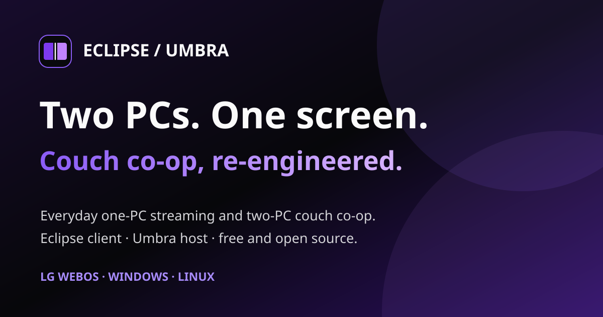
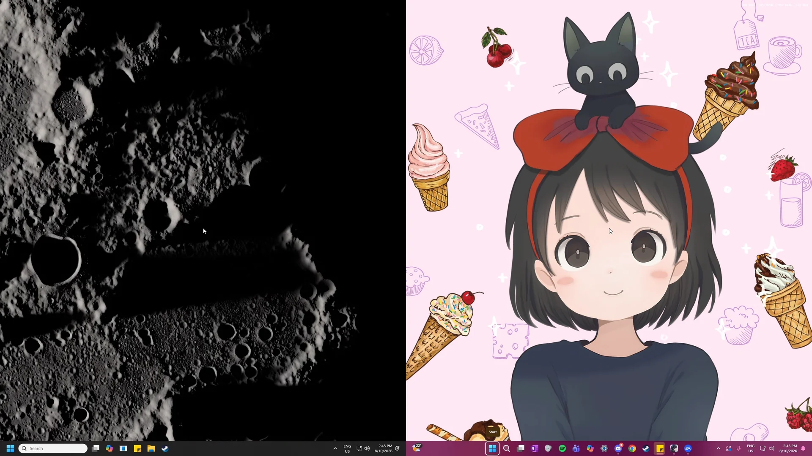

# Eclipse/Umbra Project Hub

## Two PCs. One screen. Couch co-op, re-engineered.

**Eclipse** is the client and **Umbra** is the Windows host. Use them for familiar one-PC remote game streaming—or combine two independent PCs into one side-by-side or stacked couch co-op view.

**Eclipse:** LG webOS · Windows x64 · Linux x86_64 &nbsp;|&nbsp; **Umbra:** Windows x64

[Install Eclipse/Umbra](docs/installation.md) · [See how it works](#how-it-works) · [Open the project website](https://preceptorofmagic.github.io/Eclipse-Umbra-Project-Hub/)

[Project Hub](README.md) · [Installation Guide](docs/installation.md) · [Eclipse](docs/eclipse.md) · [Umbra](docs/umbra.md) · [Development](docs/development.md) · [Acknowledgements](ACKNOWLEDGEMENTS.md)

**Built from Moonlight and Sunshine, through Moonlight TV, Aurora and Apollo.** [See the creators and open-source projects that made this possible.](ACKNOWLEDGEMENTS.md)

Eclipse/Umbra’s additions use AI-assisted coding, including Claude and Codex. [How the project is developed.](docs/development.md#development-process)

Human-played Halo: Combat Evolved Anniversary on two Umbra hosts, streamed by Eclipse on Windows. Capture and trimming by Codex. Halo is a Microsoft game.

## Your games run on your PC. Play where you want.

### What Moonlight and Sunshine do

[Moonlight](https://moonlight-stream.org/) is a client: it receives video and audio and sends your controls back. [Sunshine](https://github.com/LizardByte/Sunshine) is a host: it captures and encodes a gaming PC’s output. Games still run on your own hardware; this is not a cloud-game subscription or a game library.

Eclipse follows Moonlight → Moonlight TV → Aurora. Umbra follows Sunshine → Apollo: it is Apollo with the additions Eclipse needs for co-op, keeping other changes to a minimum. Apollo’s everyday host functionality remains the foundation. [How Umbra follows Apollo.](docs/umbra.md#apollo)

### What you need

- One Windows gaming PC running Umbra; two for two-host co-op.
- Eclipse on an LG webOS TV, Windows x64 PC or Linux x86_64 desktop.
- A reachable home network, ideally wired, plus controllers or keyboard/mouse.
- Your games installed on each host and any accounts the games require.

You do not need a second client for the second player. A separate device hub is optional, not part of the standard installation.

Two PCs do not turn one single-player game into a shared multiplayer world. Each PC runs an independent session; the game itself decides whether those sessions can play together online or over a LAN.

## Start with one host. Add a second when the couch fills up.

Co-op is the defining addition, not a replacement for standard game streaming. Eclipse and Umbra retain the normal host pairing, app launching, video, audio and input experience expected from their Moonlight/Sunshine lineage.

### Standard streaming: one host → one client

Pair Eclipse with Umbra, choose a game or desktop, and stream to the TV or desktop client. Configure resolution, frame rate, bitrate, codec, HDR, audio and input according to the capabilities of the client, host and network.

- Remote game and desktop launch
- H.264 and HEVC; AV1 on compatible webOS paths, HDR where supported
- Gamepads, keyboard and mouse
- Performance overlay and session diagnostics

### Two-host co-op: what co-op means here

Choose two paired Umbra PCs. Eclipse receives both live sessions, places them side by side or stacked, and routes each player's assigned controls to the correct host.

- Two independently rendered games
- Side-by-side or top-and-bottom layouts
- Explicit Player 1 and input ownership
- Automatic compatible encoder selection

## Familiar streaming. More ways to play together.

The everyday capabilities come from Moonlight, Sunshine, Moonlight TV, Aurora and Apollo. Eclipse/Umbra builds on that work with coordinated two-host play, device routing and practical improvements. The [feature catalogue](docs/features.md) has the details:

- [The streaming foundation we keep](docs/features.md#the-streaming-foundation-we-keep) — your PC remotely, picture and sound controls, and the controls you already have.
- [Two independent PCs, one shared view](docs/features.md#features-coop) — both layouts, automatic desktops and compatible encoding.
- [One co-op session to manage](docs/features.md#features-session) — a shared bandwidth budget, pause, resume and quit.
- [Controls go to the right PC](docs/features.md#features-input) — remembered controllers, pane-aware pointing and Nintendo layouts.
- [Two games, with sound you control](docs/features.md#features-audio) — stereo mixing, speaker restoration and shared sounds played once.
- [Fit the setup you actually use](docs/features.md#features-devices) — local-host play, monitor control, wired TV networking, desktop usability and clean installs.
- [Reports that explain what went wrong](docs/features.md#features-diagnostics) — client and host evidence, crash records and shareable bundles.

Want the implementation details? The [Development guide](docs/development.md) covers composition, reference-frame holds, buffering, build pipelines and the experiments that shaped them.

## Watch Halo co-op in both layouts.

Watch human-played Halo: Combat Evolved Anniversary on two Umbra hosts, streamed together by Eclipse on Windows:

- [Vertical split — side by side, 1:10 with audio](https://preceptorofmagic.github.io/Eclipse-Umbra-Project-Hub/#halo-vertical): island arrival and beach combat, ending at a lull in the action. Slight audio glitches during the opening come from the co-op audio feature, which needs further tuning.
- [Horizontal split — stacked, 1:25 with audio](https://preceptorofmagic.github.io/Eclipse-Umbra-Project-Hub/#halo-horizontal): a separate run, from island arrival to the cleared beach and checkpoint.

Both are continuous excerpts recorded on 8 October 2026. PC1 runs Eclipse and streams PC2 and VEGA. Videos load only when you choose to play them.

## Cross-vendor co-op needs both ends of the connection.

Two independently encoded streams cannot always be joined safely when the hosts use different GPU vendors. Eclipse and Umbra are developed together so the client can request a compatible co-op mode and the host can use the custom encoder path and stream contract it requires.

| Gaming PCs → Umbra hosts | Shared display → Eclipse client | Players → one couch |
|---|---|---|
| Capture each game, choose a compatible hardware or custom co-op encoder, and send two independent sessions. | Negotiates the co-op contract, composes the panes, mixes or selects audio, and keeps input ownership separate. | Each player controls their own PC while both games appear on one television or desktop display. |

The work was kept as a coordinated client-and-host project because broad co-op compatibility required changes on both sides. Anyone is welcome to adapt the functionality for Aurora, Apollo, or any other Moonlight/Sunshine fork.

## What has been tested—and what still needs your hardware.

The table separates working targets from combinations that have actually been exercised. A supported code path is not the same as a promise that every TV, OS, GPU and driver combination has been verified.

Compatibility and test coverage as of October 2026:

| Area | Tested hardware / software | Result | Coverage gap |
|---|---|---|---|
| LG webOS client | LG G5, webOS 26 (11.2.0 / firmware 43.21.77), wired through a UE300 USB Ethernet adapter | **Tested.** Standard streaming and the two-host co-op path run on the project television. | Other LG models, SoCs, decoder combinations and earlier/later webOS releases need community testing. |
| Windows client | Windows 11 x64 on the Radeon RX Vega test PC; D3D11VA hardware decode | **Tested.** Standard and co-op sessions, diagnostics and recovery have been exercised. | Windows 10, Windows on ARM, Intel-only clients, other GPU generations and broader decoder/driver combinations remain unverified. |
| Linux client | x86_64 Ubuntu 22.04/26.04, Fedora 44 and Arch environments under WSL; NVIDIA NVDEC | **Tested.** Single-host/co-op streaming and diagnostics exercised under WSL; this is not native-Linux certification. | Bare-metal Linux and native AMD/Intel VAAPI remain unverified. Experimental WSL VAAPI tests showed crashes and visual faults. |
| Umbra hosts | Windows 11 x64; NVIDIA RTX 4070, NVIDIA RTX 3070 and AMD Radeon RX Vega systems; Ubuntu 22.04/24.04 packages | **Tested.** Single-host streaming and host diagnostics work across the project systems. The Ubuntu packages pass install, upgrade and removal checks; Linux hosting has had one live test. | Windows 10, Windows Server, Windows on ARM, Intel Arc/iGPU hosts and newer AMD generations need coverage. Linux hosts need live testing, including co-op. |
| NVIDIA + NVIDIA co-op | RTX 4070 + RTX 3070, Windows 11; 10-bit HEVC/HDR path | **Measured.** Two-host co-op has been used and measured on the primary rig. | Other NVIDIA architectures, driver branches, resolutions and refresh rates need reports. |
| NVIDIA + AMD co-op | RTX 4070 / RTX 3070 + Radeon RX Vega, Windows 11; custom GPU HEVC co-op path | **Measured.** Live mixed-vendor co-op has been demonstrated. | Fast-motion image quality and high-bitrate stability remain active work. Newer AMD encoders, HDR and longer sessions need coverage. |
| AMD + AMD co-op | No second AMD host is available on the project rig | **Needs testing.** The code path exists but this pairing has not been run on two physical AMD hosts. | AMD × AMD is a priority community test, especially RDNA-era GPUs and HDR-capable hardware. |
| Intel and mixed Intel co-op | No representative Intel host pair in the project rig | **Needs testing.** Standard host encoder support does not establish Intel co-op support. These co-op combinations are not verified. | Intel × Intel, Intel × NVIDIA and Intel × AMD reports are needed. |

### Try it outside the tested matrix.

If something fails, open an Eclipse or Umbra issue—or reply in the project’s community thread—with the exact OS, GPU, driver, client and display. [Eclipse’s Share logs feature](docs/installation.md#diagnostics) packages system capabilities, settings, session events, performance totals, host logs and crash or unclean-exit records so a report can be investigated without guesswork. Review the bundle for personal information before attaching it.

[Report an Eclipse issue](https://github.com/PreceptorOfMagic/Eclipse/issues/new/choose) · [Report an Umbra issue](https://github.com/PreceptorOfMagic/Umbra/issues/new/choose)

## The route was not a straight line.

The useful history includes the dead ends. These are dated outcomes from project records, not fresh reproductions of every experiment. Credit is attached to documented contributions; where the record does not establish who first proposed an idea, the account does not invent an author. The [detailed history](docs/development.md#detailed-history) goes a level deeper, step by step.

22–30 July · Finding the core path — Dual decoding, the half-stream proposal and the header-alignment breakthrough

### 22 July · Building on existing clients and hosts

The Eclipse modification record begins with Aurora and Moonlight TV, rather than a new client from scratch. The goal was two independently running PCs on one TV while retaining normal streaming. Sunshine and Apollo provided the host foundation.

### 25–30 July · Two decoders were not a complete display solution

Early probes appeared to grant a second decoder, then suggested only one was usable. Further AI-led investigation corrected that conclusion: two decoders could survive together at a smaller combined workload. The unresolved obstacle was obtaining two usable native-app display/sink paths. The outcome was not “LG TVs physically have one decoder”; it was that this route did not yield the required composition/display solution.

### 28 July · PreceptorOfMagic proposes joining halves before decoding

The pivotal suggestion was for each PC to send its own half-picture and for the client to join the two into one decodable picture. Both PCs would keep their direct connection to the TV, without relaying one through the other. AI implementation first proved compatible-slice splicing from full-size source streams; true pane-sized host desktops followed.

### 28–30 July · Cropping is not a half-sized desktop

Early versions selected regions of full-resolution desktops and used blanking overlays. PreceptorOfMagic noticed the missing taskbar and pushed for Windows itself to see the pane-sized desktop. The implementation moved to half-height encoding, rewritten composite dimensions and relocated slice data, so the game and desktop could fit the visible pane.

### 29 July · A misleading codec error turns out to be bit alignment

Inserting a slice address shifted the header length and displaced entropy-coded payload, producing apparent QP/decode errors. AI diagnosis and implementation repaired complete-header parsing and byte alignment before copying the original payload. Component decoding then validated the rewrite. That was a structural proof, not yet proof of sustained live co-op.

<!-- activity:history-first-path:start -->
**Behind the build · 22–30 July 2026**

- **User prompts:** 53
- **Tokens processed:** 412,175,826
- **Models:** `claude-opus-4-8`, `claude-opus-5`

These numbers are incomplete because some records from this period were deleted.
<!-- activity:history-first-path:end -->

Late July–August · Learning to preserve time and references — Ghosting, role reversal, queues, holds and corrected measurements

### Late July–early August · A still pane is not a reusable packet

Predictive pictures exposed why arbitrary drops or repeats were unsafe. Reapplying residuals could corrupt a held pane, while omitting a reference picture broke later prediction. Sequence tracking, bounded buffering, bootstrap/keyframe handling and synthetic all-skip holds became core architecture rather than optional smoothing.

### 3–4 August · Swapping primary hosts changes the fault

User observations during role swapping exposed a scheduling asymmetry: a slower or static primary did not drain a faster peer often enough. A deeper queue stored increasingly old content; high host floors produced more duplicates. The design direction changed to an independent composite picture count and extra catch-up pictures that advance the queued pane while safely holding the other. The initial design note was not itself an implementation result; current code supplies bounded catch-up paths, explained in the Development guide.

### Early August · AI conclusions needed retraction, not decoration

Some apparently successful tests had invalid inputs; a separate frame-extraction error made a correct hold look degraded. Fresh live capture and frame-accurate comparison reversed those findings. The improvement was methodological as well as technical: verify the actual input, the displayed picture and the effect of a setting instead of accepting healthy counters or a plausible explanation.

<!-- activity:history-timing:start -->
**Behind the build · 25 July–31 August 2026**

- **User prompts:** 286
- **Tokens processed:** 2,676,527,028
- **Models:** `claude-haiku-4-5-20251001`, `claude-opus-4-8`, `claude-opus-5`, `claude-sonnet-5`

These numbers are incomplete because some records from this period were deleted.
<!-- activity:history-timing:end -->

Late August–16 September · The cross-vendor detour — Native HEVC mismatch, the abandoned AVC route and a shared encoder

### 30 August · Healthy counters, wrong picture

The investigated NVIDIA HEVC output used 32×32 coding-tree blocks while the AMD native output used 64×64. Their pane data could not simply share one composite picture’s structures. This explained a grey peer pane despite apparently healthy receive/decode counters. The finding applied to those native outputs, not to all possible AMD/NVIDIA co-op.

### Late August–15 September · AVC was explored, not casually dismissed

AVC’s fixed macroblock geometry offered a way around the HEVC block-size mismatch. A small side-by-side proof worked, but target-size composition met the tested NVIDIA encoder’s slice-count ceiling. Other parameter-compatibility and presentation problems followed. Later live controls showed stale content even without AMD or synthetic holds, invalidating explanations that blamed those alone.

The experimental co-op AVC route was retired on 16 September. The lesson was not that AVC can never express this layout, nor a universal decoder frame-rate limit. This implementation path did not meet the target constraints.

### 15–16 September · Keep the direct architecture; control both encoders

AI audits of vendor APIs and existing implementations did not produce a small native compatibility fix. With the user’s direct-host/no-relay requirement intact, work returned to HEVC: keep the established native NVIDIA-pair route, and use a shared programmable encoder on both hosts for affected pairings. Host prediction and client composition stayed separate responsibilities. This solution builds on upstream codec work, including x265.

<!-- activity:history-cross-vendor:start -->
**Behind the build · 18 August–16 September 2026**

- **User prompts:** 491
- **Tokens processed:** 4,403,521,774
- **Models:** `claude-haiku-4-5-20251001`, `claude-opus-4-8`, `claude-opus-5`, `claude-sonnet-5`, `gpt-6-astra`

These numbers are incomplete because some records from this period were deleted.
<!-- activity:history-cross-vendor:end -->

16–29 September · Correct bytes were only the start — Parallel CABAC, integration failures, quality work and rollbacks

### 16 September · An AI algorithmic contribution changes the GPU path

A correct but largely serial GPU CABAC port took tens to hundreds of milliseconds in component tests. The AI-developed context-grouping and finite-state-scan approach changed the algorithm rather than merely tuning that serial port. Predicted-frame CABAC fixtures reached roughly 1–2 ms with exact reference bytes. This was meaningful component progress, not an end-to-end latency claim.

### 16–18 September · Integrating a real encoder exposes new failures

Residual coding, transforms, quantisation, reconstruction, budgeting and live host capture were brought together. Tests then found capture-size mismatches, rough fine detail, stacked-layout failures, bitrate bursts and quantisation limits. PreceptorOfMagic rejected a special fixed frame-size ceiling; subsequent work returned budgeting to the requested bitrate and improved adaptive quantisation. Direction-setting and implementation both mattered.

### 17–29 September · Roll back a regression, keep the remaining problem visible

An extra quantisation attempt in one revision raised worst-case encode time and produced visible hopping. Rolling it back removed that symptom. Later lowering the QP floor improved some light static, but motion-related QP jumps remained in both older and newer versions. Cross-vendor composition had become real; native-encoder quality and performance parity had not been established.

<!-- activity:history-gpu:start -->
**Behind the build · 16–29 September 2026**

- **User prompts:** 215
- **Tokens processed:** 4,410,273,647
- **Models:** `claude-opus-5`, `claude-opus-5-5`, `claude-sonnet-5`, `gpt-5.6-sol`, `gpt-6-astra`
<!-- activity:history-gpu:end -->

Late September–October · Making it usable and maintainable — Desktop clients, a firmware crash, automatic setup, the thin Apollo fork and the first public release

### Late September · Desktop clients and session recovery

Windows and Linux client work exercised mixed-vendor co-op beyond the TV. Packaging moved toward a portable Linux baseline and staged Windows dependencies. Local-host input/focus, resume, audio-endpoint restoration and shareable diagnostic bundles addressed everyday failures around the stream itself. WSL and container coverage remained distinct from native Linux driver validation.

### 26 September · A firmware update exposes a symbol collision

On webOS 26, first-stream media-plugin scanning resolved a library call to the application’s exported `g_log` data symbol. AI-led diagnosis identified that collision; renaming the symbol and adding a post-link export guard addressed the specific crash. The new test lesson was to exercise first use after install/firmware changes, not only repeated launches. This did not close every unrelated stream-start fault.

### Late September–3 October · Co-op becomes a coordinated launch

The built-in pane, capability-based encoder selection and divided default bitrate replaced manual host edits. Resume and Quit gained two-host semantics. Umbra’s branding and changes were then isolated into a smaller Apollo delta, preserving upstream documentation, translations and maintained everyday functionality instead of duplicating them.

### Early October · Smaller features and the passive audio gate

Remote-monitor choices, remembered input assignments, Nintendo mapping, remote-device filtering, wired-TV routing and richer logs made the app fit more real setups. Duplicate-audio work explored several filtering strategies before settling on a passive gate, now the default way shared sounds are played once.

### 6–10 October · Keeping the second PC’s sound in step

Player 2’s sound had been drifting behind; batching its audio messages fixed the backlog, and a receiver that discarded the start of each stream was corrected. The shared-sound filter gained Accurate, Fast and Off choices.

### 10 October · First releases, and the first public one

Eclipse and Umbra were packaged for the first time. Same-day updates kept settings and co-op working after an LG TV restarts, following an audit of every place the TV app keeps files. Scoring the shared-sound filter against Halo’s own sound files led to guards that keep sounds only one PC played. Eclipse 1.3.4 became the first public release.

<!-- activity:history-product:start -->
**Behind the build · 23 September–5 October 2026**

- **User prompts:** 247
- **Tokens processed:** 5,011,694,573
- **Models:** `claude-opus-4-8`, `claude-opus-5`, `claude-opus-5-5`, `claude-sonnet-5`, `claude-sonnet-5-5`, `gpt-5.6-sol`, `gpt-6-astra`
<!-- activity:history-product:end -->

## Eclipse and Umbra

### Eclipse · client

Install on the television or computer where you want to play. Pair it with one Umbra host for regular streaming or two for co-op. [Explore Eclipse →](docs/eclipse.md)

### Umbra · host

Install on each Windows or Ubuntu gaming PC. Apollo supplies the everyday host experience; Umbra keeps other changes to a minimum while adding the encoder and session behaviour required by Eclipse co-op. [Explore Umbra →](docs/umbra.md)

## Before you install.

### Can I just stream one PC?

Yes. Regular streaming is a first-class mode: pair, choose an app, play. Resolution, frame rate, bitrate, codec, audio and input remain configurable. Hardware capabilities determine available codecs, HDR and performance.

### Do I need Umbra for co-op?

Use matching Eclipse and Umbra releases on both hosts for the coordinated co-op mode. Regular Moonlight-compatible streaming does not imply that another host supports the custom co-op encoder contract.

### Does it cost anything?

The project is free and open source. You provide the gaming PCs, display, network and games.

### What does a working result mean?

The status table records the project’s actual rigs, not a guarantee across all hardware. At high resolutions Windows frame readback can limit presentation, and custom-encoder motion quality is still being improved. Start with a normal stream and report your exact setup.

[Eclipse/Umbra licence & notices](LICENSES.md) · [GPL-3.0](LICENSE.txt) · Code signing policy: [Eclipse](https://github.com/PreceptorOfMagic/Eclipse/blob/main/CODE_SIGNING_POLICY.md) · [Umbra](https://github.com/PreceptorOfMagic/Umbra/blob/release/umbra-0.5/CODE_SIGNING_POLICY.md)
