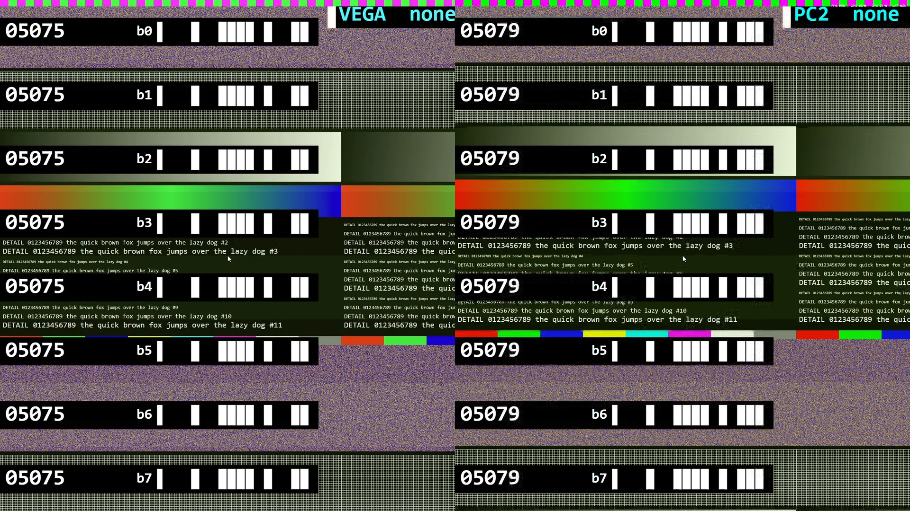
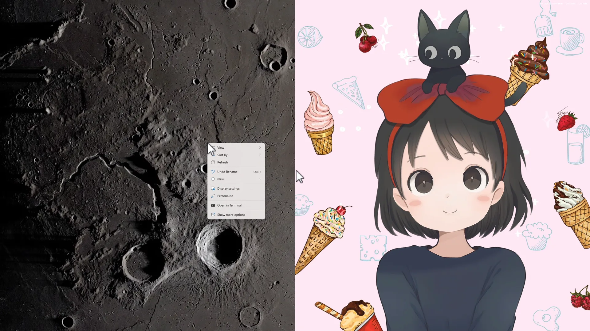

[Project Hub](../README.md) · [Installation Guide](installation.md) · [Eclipse](eclipse.md) · [Umbra](umbra.md) · [Development](development.md) · [Acknowledgements](../ACKNOWLEDGEMENTS.md)

# Understand the whole connection.

A contributor’s guide to the client, the thin Apollo host fork, and the experiments behind two-host composition. Open a section for implementation details; the overview stays short.

[Eclipse source](https://github.com/PreceptorOfMagic/Eclipse) · [Umbra source](https://github.com/PreceptorOfMagic/Umbra)

[Architecture](#architecture) · [Source map](#repositories) · [Builds](#build) · [Detailed history](#detailed-history) · [Open work](#open-work)

<a name="development-process"></a>

## How this project is developed

PreceptorOfMagic and AI coding tools, including Claude and Codex, develop Eclipse/Umbra’s additions together. PreceptorOfMagic sets goals, orchestrates the work, contributes high-level design and tests the results hands-on. The AI tools contribute implementation, research, instrumentation and diagnosis—including ideas that worked, experiments that failed and conclusions that needed correcting. This describes these forks, not the authorship of their upstream foundations.

The history below separates implementation from recorded test results and abandoned hypotheses. A component benchmark is not end-to-end latency; a successful decode counter is not proof of a correct screen. See the [hardware and testing matrix](../README.md#status) for the scope of current evidence.

<a name="architecture"></a>

## Two sessions. One decodable picture.

Each PC captures, encodes and sends its own pane directly to Eclipse. The client coordinates those streams, joins compatible HEVC picture data, then passes one composite stream to its decoder. Audio and input keep their separate host identities.

<a name="composition"></a>

<details>

<summary>1. Capture, pane geometry and compressed-frame composition — Why half-sized desktops and compatible headers matter</summary>

### The host supplies a pane, not a cropped full desktop

Eclipse requests the built-in Co-op Pane from each Umbra host. Its virtual desktop matches that host’s share of the chosen output: half-width for side-by-side, half-height for stacked. Windows and the game therefore see a usable desktop at that size. Coding dimensions still need alignment to the codec’s coding-tree grid; visible size and coded size need not be identical.

[](https://preceptorofmagic.github.io/Eclipse-Umbra-Project-Hub/development.html#composition)

Every band in a pane is drawn in one pass with the same step number, so a pane assembled from slices of different moments would show bands that disagree. Each pane’s bands agree throughout; the two panes differ because each PC draws from its own clock.

*Recorded by an AI assistant (Claude) while the developer was away, as a capability test: every click and key press was planned in advance and played back automatically on live hosts.*

Each connection retains Moonlight-compatible discovery, pairing, launch/control, video/audio transport and return input. The secondary connection has its own session process; its encoded access units reach the compositor through inter-process communication. An access unit is the encoded data needed for a picture, not a decoded pixel buffer.

### What Eclipse changes

The HEVC parser reads sequence and picture parameter sets (SPS/PPS), picture order counts and slice headers. Composition describes one larger coded picture and relocates the second pane into the appropriate region, using rewritten slice addresses and, where required, tile geometry. Slice addresses and shared picture numbering must agree with that geometry. The encoded picture payload is retained; Eclipse does not decode and re-encode both games for the core composition path.

Changing a header’s bit length is not a byte-copy operation. The parser must find the original payload boundary, emit a complete new header and alignment, then append the payload at its correct byte boundary. The early half-stream prototype failed here before the alignment repair made the rewrite valid.

### Why there is a paired host fork

Both panes must satisfy a shared codec contract: compatible coding blocks, parameter sets, bit depth, reference behaviour and random-access handling. “Both are HEVC” is insufficient. In the investigated native NVIDIA/AMD pairing, their coding-tree sizes differed. Umbra can supply the compatible custom encoder on both hosts; Eclipse negotiates and composes it. Ordinary streaming retains the native host paths.

That coordinated requirement is why this work spans the Aurora-derived client and Apollo-derived host. Adapting it into Aurora, Apollo or another Moonlight/Sunshine fork is welcome.

Read: [HEVC parsing and rewriting](https://github.com/PreceptorOfMagic/Eclipse/blob/main/src/app/stream/video/coop_poc.c), [composition and decoder submission](https://github.com/PreceptorOfMagic/Eclipse/blob/main/src/app/stream/video/session_video.c), [pair-aware stream selection](https://github.com/PreceptorOfMagic/Eclipse/blob/main/src/app/stream/video/coop_stream_mode.c).

</details>

<a name="sequencing"></a>

<details>

<summary>2. Holds, reference frames, buffers and keyframes — Why repeating a compressed frame is not the same as holding a picture</summary>

### The reference-chain problem

An inter-predicted pane describes changes relative to a previous reconstructed picture. Replaying its compressed bytes can apply a residual again, rather than leave the picture unchanged. Dropping an encoded reference picture can make the next one refer to history the decoder never received. An ordinary “keep only the newest frame” video queue is therefore unsafe for this composition contract.

### A synthetic hold advances time without advancing that pane

When only one host has new content ready, Eclipse can create an all-skip slice for the other pane: the held region predicts from the previous composite picture without adding a new residual. The new host pane and the hold share the next composite picture order count (POC). Source POCs are tracked separately from that output numbering.

This relies on the supported encoder/reference structure. It is not a general-purpose transformation for arbitrary HEVC with unrestricted reference lists or reordering. Both the header rewrite and the reconstructed reference chain must remain correct.

### Bounded queues and a shared sequencer

The secondary receiver maintains a bounded queue. The sequencer judges queued units against the last accepted history: a valid next picture, an anchor, a discontinuity or a picture that cannot safely be used. Queue depth absorbs short arrival differences but also stores latency. Overflow, gaps and missing anchors need explicit recovery; there is no unconditional “never drops frames” guarantee.

An IDR resets picture-reference history for the composite, not merely one independent video surface. Other random-access pictures also need explicit handling. Bootstrap and recovery must establish valid panes and aligned history; a keyframe request alone does not prove that a usable replacement picture has arrived.

Read: [sequencer](https://github.com/PreceptorOfMagic/Eclipse/blob/main/src/app/stream/video/coop_seq.c), [synthetic hold slices](https://github.com/PreceptorOfMagic/Eclipse/blob/main/src/app/stream/video/coop_conceal.c), [peer queue and coordination](https://github.com/PreceptorOfMagic/Eclipse/blob/main/src/app/stream/video/coop_coord.c).

</details>

<a name="pacing"></a>

<details>

<summary>3. Primary roles, catch-up frames and frame-rate floors — How uneven host rates are handled—and what still depends on the primary</summary>

### Primary is a scheduling role

The primary video callback drives normal composite submission; the secondary stream supplies queued peer pictures. In the launcher, Player 1 occupies the primary left/top pane. Swapping which PC takes that role is useful when diagnosing asymmetry, but changing host roles is not evidence of automatic live primary switching. Controller ownership is configured separately; it should not be inferred from GPU speed.

### Catch up without discarding prediction history

If the peer gets ahead, the compositor can drain a bounded number of additional peer pictures during a primary callback. These catch-up composites advance the peer while holding the primary with a synthetic skip slice. Each accepted composite gets its own output POC, and the drain uses the same sequencer as normal consumption.

The loop is bounded and guarded around anchors. On the PC-decoder path it stops before consuming a queued peer IDR in catch-up, preserving that anchor for the normal path. Failed composition must not consume a picture number as though a valid frame had been submitted. Both orientations have catch-up handling, but this remains callback-driven: it is not an independent clock that guarantees output at the faster host’s exact rate when the primary stops producing callbacks.

### Floors solve a different problem

A host frame-rate floor asks for continued encoded output even when desktop capture is quiet. Duplicated capture content can keep a pipeline active, but it is not new game motion and costs encoding/network work. A larger peer buffer hides a short burst; it does not solve sustained rate mismatch. Catch-up, queue depth and host floors must be evaluated separately.

Do not copy an old floor number into a new test. Horizontal and vertical test controls have differed, and an accepted configuration value has previously failed to affect the encoder. For any tuning change, record the requested setting, its application evidence and the measurement expected to move: host encode cadence, queue age/depth, composite submissions or displayed motion. These are different rates.

Read: [normal and catch-up feed paths](https://github.com/PreceptorOfMagic/Eclipse/blob/main/src/app/stream/video/session_video.c). The August rate-decoupling note (kept in the project’s development records) explains the turning point, but is a historical design proposal, not today’s implementation inventory.

</details>

<a name="encoder"></a>

<details>

<summary>4. The custom GPU HEVC encoder — Cross-vendor structure, prediction, parallel entropy coding and quality limits</summary>

For affected host pairings, both Umbra instances use the shared programmable GPU encoder rather than trying to splice incompatible vendor-native outputs. The host encoder still owns temporal prediction, residual generation, transforms, quantisation, reconstruction and rate control. Eclipse owns pane composition and sequence coordination; moving ordinary prediction into the client would blur that boundary.

### The entropy-coding turning point

The x265-derived CABAC work initially reproduced correct bytes with a mostly serial GPU port, but the runtime was far too high. The revised algorithm grouped bins by context, used finite-state scans for dependent context transitions, and parallelised range, low and carry processing. Recorded predicted-frame component fixtures reached roughly 1–2 ms while matching reference output. That measures one stage under those fixtures, not a complete encode or controller-to-display latency.

### Correctness, quality and speed are separate gates

Integration had to add real capture, residual/reconstruction work and rate budgeting. A decodable frame can still have poor fine detail, motion blockiness, excessive bitrate or late delivery. An extra quantisation attempt increased worst-case work and visibly disrupted motion; it was rolled back. Later quality changes reduced some static noise without establishing parity with mature native encoders.

Both bit-depth builds and the required kernels must accompany a host package. Packaging can otherwise succeed without the custom encoder, leaving a host unsuitable for the intended mixed-vendor mode. Verify advertised capabilities against the actual installed files, then verify the selected path in a real session. Source conformance tests are necessary, not sufficient.

Read: [GPU HEVC source and component tests](https://github.com/PreceptorOfMagic/Eclipse/tree/main/experimental/gpu-hevc), [host encoder packaging](https://github.com/PreceptorOfMagic/Umbra/blob/umbra/thin/cmake/packaging/windows.cmake). The encoder builds on upstream work, including x265; see [Acknowledgements](../ACKNOWLEDGEMENTS.md).

</details>

<a name="input-routing"></a>

<details>

<summary>5. Session lifecycle, input ownership and local-host play — The two host identities remain separate even when the screen is shared</summary>

Co-op negotiates host capabilities, selects a compatible encoding route, requests each built-in pane and divides the default video budget between hosts. A disconnect preserves the resumable applications. Quit is an explicit end-both-hosts operation; an orientation change on resume rebuilds pane geometry. Resume and ending both host applications have been exercised on Windows and Linux. Coverage of other packaged platforms remains limited.

[](https://preceptorofmagic.github.io/Eclipse-Umbra-Project-Hub/development.html#input-routing)

*19 seconds · Silent. Recorded by an AI assistant (Codex) as a capability test: every click and key press was planned in advance and played back automatically on live hosts. Real host cursors were enlarged for visibility. Wallpapers: [“Moon Light”](https://steamcommunity.com/sharedfiles/filedetails/?id=1539918440) by Sir Crab and [“KIKI&JIJI”](https://steamcommunity.com/sharedfiles/filedetails/?id=2466412743) (art credited to Ayu) by 鬥丨Dou, from the Wallpaper Engine Steam Workshop.*

Controller assignments associate remembered devices with host destinations. Pane-aware absolute pointing maps the composite coordinate into the selected host’s desktop. Button ownership stays fixed through a drag, and keyboard key-up events return to the destination of their key-down to avoid leaving keys stuck on a different PC. Explicit per-device mouse/keyboard assignment offers an alternative to pane routing; relative and virtual-mouse behaviour needs separate testing.

When the Windows client is also a host, focus and injected input can loop back into the client unless the local pane is treated specially. The game needs a separate captured display; putting Eclipse on the same virtual display risks recursive capture. Routing a controller in Eclipse also does not revoke a handle already held by Steam or another local application. Local-device isolation, particularly wireless devices, remains an engineering gap rather than an automatic consumer guarantee.

Monitor-off requests deliberately exclude the PC displaying Eclipse. Speaker restoration tracks the pre-stream playback endpoint and handles delayed/recreated endpoints. These are session-lifecycle behaviours that need disconnect, quit, crash, restart and upgrade coverage—not just a successful first launch.

Read: [input routing](https://github.com/PreceptorOfMagic/Eclipse/tree/main/src/app/stream/input), [co-op assignments and settings](https://github.com/PreceptorOfMagic/Eclipse/blob/main/src/app/ui/settings/panes/coop.pane.c), [host application lifecycle](https://github.com/PreceptorOfMagic/Umbra/blob/umbra/thin/src/process.cpp).

</details>

<a name="audio-routing"></a>

<details>

<summary>6. Audio mixing, duplicate suppression and diagnostics — Independent audio clocks, the passive gate and evidence collection</summary>

### Mixing, then playing shared sounds once

Mixing happens inside Player 1’s audio path. Player 1 is chosen in the co-op dialog before launch (it opens on the default pair from settings, else the last session’s pair, else the selected PC) and stays fixed for the session: Eclipse’s main process streams from it, and Player 2 streams in a helper process. Each of Player 1’s audio packets is decoded, Player 2’s sound is added to it, and the result goes to the platform’s audio player. The mixer does not wait for Player 2; the gate adds the delay described below.

Player 2’s sound is decoded in the helper process, passed over a local socket and held in a jitter buffer that fills to 40 ms before it plays (adjustable in the advanced co-op settings). If that buffer grows past 120 ms it is trimmed back to 40; if it runs dry, silence is mixed until it refills, so Player 1’s sound never waits for Player 2’s.

If Player 1 sends no sound for 40 ms, a timer takes over feeding the mix so Player 2 is still heard, and hands back when Player 1’s sound returns. A soft limiter turns down loud combined moments instead of clipping them; it changes gain only, never timing. This is not the ordinary host’s 5.1/7.1 path.

Shared narration, music or effects can arrive from both games with a delay between them. The first suppressor found one delay and turned the later copy down. Real-game captures on 4 October showed several copies at different delays at the same time (+272 and +353 ms within one cutscene), so a filter tracking one delay dropped in and out, which PreceptorOfMagic heard.

The passive gate replaced it as the default. It splits each stream into six frequency bands per channel, compares their waveforms at up to 16 delays at once, and mutes the later copy in each band and channel where the two match; Fast mode also closes slightly ahead when the earlier copy’s onset predicts a line. Other sound the later PC plays in a muted band can be muted with it while the band is closed. Since 1.3.4, a band held closed reopens as soon as the later PC plays sound the other PC did not play at that delay, a copy much quieter than the sound it would remove is ignored, and a sound is not removed because of a copy that was itself removed. After 20 clean matches it also balances the two PCs’ levels, meeting in the middle by up to 6 dB each, and that balance applies to all of their sound.

Accurate, the default, decides each block with its look-ahead (40 ms by default, adjustable from 0 to 100 ms) of the copy’s future in view and makes no predictions, so both streams play the look-ahead plus 5 ms later. Fast holds both streams back by one 5 ms block (240 samples at 48 kHz): Player 1’s sound plays 5 ms later, and Player 2’s gets the same 5 ms on top of its buffer. Where Eclipse feeds the speakers itself (Windows, and Linux with PulseAudio), Accurate currently runs as Fast. The earlier single-delay filter held both for 10.7 ms (512 samples).

The gate adds no intentional video buffering. The mixer and the gate run on the audio path, not the video thread. On webOS, Eclipse stamps each piece of sound and picture with the time since the stream opened, read when it is handed to the TV’s player, so holding sound back leaves the picture’s timestamps unchanged; the desktop video path has no reference to audio.

In an offline benchmark on the TV using recorded captures, the gate used about 7.8% of one CPU core, against 6.4% for the earlier filter.

Simulator tests on the same captures measured how far the later copy is turned down per line: ordinary speech about 23 dB, speech with “s” sounds about 14 dB, whispers, breaths and other noise-only lines about 3–7 dB, and copies playing 0.5–2% slower about 1.5–4.7 dB. Noise-only lines can also lower the earlier copy by up to 0.8 dB. The earlier single-delay filter can still be selected for comparison testing.

### Evidence across both ends

Diagnostic bundles combine build identity, OS/firmware, capabilities, settings and session statistics with peer and capable-host logs. Crash/frozen-UI and unclean-exit records help preserve the previous failure on restart. Export is local on Windows, with network download routes on Linux and webOS. Redaction removes known secrets, not every name or address; review before posting.

For timing work, distinguish capture/encode cadence, packet arrival, queue delay, decoder submissions and actual presentation. Match records by session and clock domain. A visually wrong pane can coexist with healthy decode counters, so a screen observation remains part of the verdict.

Read: [mixer and duplicate-sound filters](https://github.com/PreceptorOfMagic/Eclipse/tree/main/src/app/stream/audio), [diagnostic bundle contents](https://github.com/PreceptorOfMagic/Eclipse/blob/main/docs/support-logs.md).

</details>

<a name="repositories"></a>

## Know which tree owns the change.

A development branch is not a release identifier; use the exact source commit recorded with a package.

<a name="source-map"></a>

<details>

<summary>Repository, module and dependency map — Client integration, current feature work, thin host fork and website</summary>

### Eclipse

The public [main](https://github.com/PreceptorOfMagic/Eclipse/tree/main) branch holds each release, and the `eclipse-v*` tags mark the exact commit every package was built from. Day-to-day development happens privately and lands in `main` with each release, so build from a release tag to match the published packages.

- `src/app/ui/`: LVGL launcher, settings, co-op selection and stream interface.

- `src/app/stream/`: session workers and peer IPC; `video/` contains HEVC parsing, sequencing, concealment and submission; `audio/` contains mixing and the duplicate-sound filters; `input/` owns host-directed input.

- `third_party/ss4s/` and platform modules: media backends, including webOS and desktop FFmpeg paths. Windows uses D3D11VA decode; Linux has NVDEC/VAAPI paths with different test coverage.

- `experimental/gpu-hevc/`: shared custom host encoder source, kernels and component tests. Its location in the client repository does not mean it runs as a client-side re-encoder.

- moonlight-common-c supplies connection/protocol foundations; LVGL, SDL, FFmpeg, Opus and network/crypto dependencies retain their own upstream roles and licences.

### Umbra

[umbra/thin](https://github.com/PreceptorOfMagic/Umbra/tree/umbra/thin) is the reviewed host integration branch. Apollo/Sunshine owns the ordinary host foundation: capture, encoding, sessions, virtual displays, input and browser configuration. Umbra adds the focused co-op contract and supporting lifecycle work.

### Project Hub

[The hub repository](https://github.com/PreceptorOfMagic/Eclipse-Umbra-Project-Hub) owns `site/`, mirrored documentation and `scripts/launch/` validation. Application packages belong in their application repositories, not this website. The six-destination navigation, shared branding and release selectors are maintained together.

Initialise recursive submodules at the chosen commit. Do not replace pinned dependencies with arbitrary latest versions. [Acknowledgements](../ACKNOWLEDGEMENTS.md) records the wider stack and upstream creators.

</details>

<a name="build"></a>

## From source to a usable package.

These are the build entry points and their responsibilities. Follow the scripts at your selected commit for exact prerequisites. Building successfully does not replace clean-install, upgrade and live-session checks.

<a name="build-webos"></a>

<details>

<summary>Eclipse · LG webOS — Cross-toolchain → client/dependencies → symbol guard → IPK</summary>

Build from Linux/WSL using the webOS wrapper. It bootstraps client dependencies, locates or fetches the pinned buildroot-nc4 cross-toolchain and drives the CMake build through the project’s build wrapper. Use its required CMake/awk tooling and recursive submodules, not an unrelated generic ARM compiler.

```
./scripts/webos/build_for_lg.sh
```

The media integration links into webOS’s native playback environment. A post-link symbol-export guard protects against application symbols interposing on system libraries—the cause of the webOS 26 first-stream crash. Packaging produces an IPK in `dist/`, retaining the inherited live app identifier; the beta variant has its own identity and build directory.

A rebuild can overwrite the same versioned IPK filename, so preserve a known-good package first. Installation alone does not restart an already running app: close and relaunch it before evaluating new code. Test first stream after a fresh install or firmware update as well as later launches.

[Build wrapper](https://github.com/PreceptorOfMagic/Eclipse/blob/main/scripts/webos/build_for_lg.sh) · [Firmware/symbol-collision investigation](https://github.com/PreceptorOfMagic/Eclipse/blob/main/docs/webos26-media-load.md) · [User installation](installation.md#eclipse-webos)

</details>

<a name="build-windows"></a>

<details>

<summary>Eclipse · Windows portable client — PowerShell + MSYS2 MINGW64 → CMake/Ninja → dependency closure → ZIP</summary>

The Windows client uses the common LVGL client code, not a separate Qt rewrite. Run the portable builder from Windows PowerShell with its MSYS2 MINGW64 environment. This differs from Umbra’s UCRT64 host toolchain.

```
powershell.exe -NoProfile -ExecutionPolicy Bypass -File scripts/windows/build_portable.ps1
```

The script configures/builds with CMake and Ninja, installs into staging, then follows PE imports to collect the needed MinGW DLLs without bundling Windows system DLLs. It adds the runtime assets and produces the unsigned client ZIP and checksum in `dist/`. The executable retains its inherited `moonlight-tv.exe` name.

Preserve the whole extracted directory. Verify package provenance and dependencies on a clean Windows machine, then ordinary streaming, both co-op orientations, input, audio and reconnect/quit. Hardware decoding does not imply zero-copy display: the current readback/presentation path can bottleneck high-resolution output independently of the decoder.

[Portable builder](https://github.com/PreceptorOfMagic/Eclipse/blob/main/scripts/windows/build_portable.ps1) · [User installation](installation.md#eclipse-windows)

</details>

<a name="build-linux"></a>

<details>

<summary>Eclipse · Linux portable client — Ubuntu 22.04 baseline → pinned dependencies → runtime staging → archive</summary>

The portable route targets an x86_64 glibc 2.35 baseline using an Ubuntu 22.04 sysroot. The sysroot and dependency builders prepare that environment; the portable script then configures the client with its toolchain, stages runtime libraries and inspects dynamic dependencies.

```
./scripts/linux/portable/make_sysroot.sh
./scripts/linux/portable/build_deps.sh
./scripts/linux/build_portable.sh
```

The bundle deliberately does not carry glibc or a replacement GPU driver. Its launcher establishes the intended library search paths and selective fallbacks; starting the internal executable directly is not equivalent. Packaging includes source/build state, licences and hashes so the archive can be traced to what was built.

Distribution-container and WSL checks help find dependency problems. They do not verify every native display server, compositor or GPU driver. Recorded co-op coverage uses NVDEC under WSL; native AMD/Intel VAAPI needs independent validation, and the experimental WSL VAAPI path showed instability.

[Portable builder](https://github.com/PreceptorOfMagic/Eclipse/blob/main/scripts/linux/build_portable.sh) · [Sysroot and dependency scripts](https://github.com/PreceptorOfMagic/Eclipse/tree/main/scripts/linux/portable) · [User installation](installation.md#eclipse-linux)

</details>

<a name="build-umbra"></a>

<details>

<summary>Umbra · Windows host and minimal Apollo delta — UCRT64, web assets, custom encoder payload, installer and upstream checks</summary>

Use `umbra/thin` and recursive submodules. The host build uses MSYS2 UCRT64, CMake, Ninja, Node and NSIS alongside its documented capture/encoding, crypto, input and networking dependencies. The host build guide contains an older branch example; select the current integration branch explicitly rather than treating that example as the source of truth.

CMake builds the host and browser assets; CPack produces the NSIS installer or portable package. Build the shared GPU HEVC source for both supported bit depths and include the encoder DLLs plus kernels when configuring the host package. The packaging check rejects an explicitly supplied incomplete encoder directory, but omitting it can produce a package without that encoder. Verify the final payload and capability advertisement before labelling a release mixed-vendor capable.

### Keep Apollo maintainable

Umbra keeps new behaviour and identity in its own files with small integration points. Apollo’s root README, translations and resource cards remain intact. Umbra’s introduction lives in `.github/README.md`; its UI layer includes `umbra_identity.js`, `umbra.css` and `UmbraCard.vue`. The shared logo comes from the hub master.

```
node scripts/umbra_check.mjs
```

This checks the changed-file boundary against `scripts/umbra-delta.txt`. Follow the upstream-sync checklist and test ordinary streaming as well as co-op after merging Apollo. Versions use `<Apollo release>-umbra.<revision>`; preserve that version through reconfiguration. The updates panel compares published releases and records the installed Apollo base—it does not establish that every upstream commit is integrated.

The installer intentionally replaces Apollo in place and retains its installation/configuration identity. Switching back replaces Umbra. Test config and pairing preservation, upgrade, rollback and uninstall; do not describe the two hosts as independent side-by-side installations.

[Host build guide](https://github.com/PreceptorOfMagic/Umbra/blob/umbra/thin/docs/umbra-windows-build.md) · [Apollo update checklist](https://github.com/PreceptorOfMagic/Umbra/blob/umbra/thin/docs/umbra-upstream-sync.md) · [User installation](installation.md#umbra-windows)

</details>

<a name="detailed-history"></a>

## Step by step, including the retractions.

This goes a level below the [development history on the Project Hub](../README.md#timeline): the individual experiments, measurements, fixes and withdrawn conclusions in date order. Figures are the ones recorded at the time, on the project’s own hardware: an RTX 4070 host, an RTX 3070 host, a Radeon RX Vega host and an LG G5 television.

<a name="detail-first-path"></a>

<details>

<summary>22–30 July · Finding the core path — Groundwork, three spikes, exhausted display routes and the first spliced picture</summary>

### 22–25 July · Groundwork before co-op

The first changes were to ordinary streaming. Hosts are resolved at run time instead of being pinned to addresses that change after every power cycle. A woken Windows PC gets its sign-in PIN entered per host. Suspend and resume restore the physical monitor without tearing down the virtual display. Keyframe requests are throttled. Interrupted sessions record why they stopped. An Xbox controller and microphone transport was built for the optional device hub. Much of this later carried co-op launch.

### 25 July · The design is written down and probes are gated

The split-screen design and its open questions were recorded before any co-op code shipped. Each experiment sat behind a gate, so a probe could not change normal streaming. The first gated probe asked whether the G5 would run two independent decode pipelines.

### 26 July · Three spikes in a day

Spike 1, two decode pipelines, failed. Spike 2, positioning split-screen video planes, passed. Spike 3, a second audio output, was refused in-process, and its result invalidated Spike 1’s conclusion. The decoder question was reopened rather than closed.

### 28 July · Every TV-side display route is tried

AI-led probing worked through the TV’s native Multi-View, exporting a second window through the webOS foreign-surface protocol, surface groups, a headless secondary session and a directly created second media pipeline. Multi-View worked, but placing this app in a pane was blocked by app privileges. The second pipeline loaded but never displayed; two days later it was found to be connected to no video sink at all.

### 28 July · One decoder, two PCs

The same day, PreceptorOfMagic’s proposal to join the halves before decoding was built. An in-app HEVC access-unit splicer was validated on real host output. A coordinator process accepted a second session’s pictures and held the latest pane. By the evening, slices from two PCs were spliced into one stream and decoding on the television.

### 29 July · Half height, and a header that moved every bit after it

Encoding each host at half height, instead of cropping a full desktop, needed the peer’s slice placed in the lower half. Writing the new slice address changed the header’s length and misaligned the payload behind it. Re-emitting the complete slice header made the composed stream decode cleanly. A ghosting detector was added because no existing metric could see ghosting, and pane drift was bounded by re-bootstrapping after accumulated concealment.

### 30 July · Half-height composition goes live

Two hosts were composed from half-height streams on the panel. Raising the pane queue to a depth of four took the fresh-pane yield from 7% to 88%. A keyframe livelock was broken by anchoring on the first accepted pane. The client stopped dropping about 29% of pictures mid-session—necessary, but not the cure for the stutter.

Two other results closed doors. A vendor media-layer error ended the TV-side dual-display route. And the all-skip concealment slice, which had appeared broken, was correct: the test harness was at fault.


<!-- activity-detail:history-first-path:start -->
**Behind the build · 22–30 July 2026**

- **User prompts:** 53
- **Tokens processed:** 412,175,826
- **Models:** `claude-opus-4-8`, `claude-opus-5`

| Week | User prompts | Tokens processed | Models |
|---|---:|---:|---|
| 22–26 July † | 32 | 87,483,048 | `claude-opus-4-8`, `claude-opus-5` |
| 27–30 July † | 21 | 324,692,778 | `claude-opus-5` |

Weeks marked † are incomplete because some records from this period were deleted.
<!-- activity-detail:history-first-path:end -->

</details>

<a name="detail-timing"></a>

<details>

<summary>Late July–August · Learning to preserve time and references — Both split directions, bit-exact seams, holds, catch-up and a parameter register</summary>

### 31 July · The vertical split finds a route

NVENC limits a picture to 64 slices and does not offer 64×64 coding blocks, so slicing every block row of a 2160-line picture was blocked. HEVC tile columns solved it: 8 slices instead of 128, full height and bit-exact. Constraining encoding to one slice per block row cost about 4.7 QP, a measured price. The vertical split became its own module that handles independent keyframes from each host.

The same day, a “flashing” fault on both halves turned out to be a looping test file, proven by mirroring the panes.

### 1 August · Horizontal co-op works

Horizontal two-host composition reached 98.9% of pictures paired, with both PCs on the panel. NVENC’s constrained encoding fixed the horizontal seam bit-exactly for about 1.1% more bitrate. PreceptorOfMagic confirmed the vertical split working live. A one-megabyte stack array in the composition path, which had crashed every stream after one picture, was removed. And a left-over file-playback hook was found to have silently replaced two hours of live testing—the origin of the project’s rule to test live connections only.

### 2 August · The concealer becomes bit-exact

Two wrong arithmetic-coder initialisation values were found in the synthetic hold picture. Fixing them took it from 22.4 dB to an exact match. The composite was paced at the slower host, the queue was deepened, and a broken reference chain is now held rather than shown.

### 3–5 August · Role swapping changes the design

Swapping which PC was primary showed the peer’s picture quality was hostage to the primary’s frame rate, so the two were decoupled. Horizontal was rebuilt on the tile machinery, and catch-up pictures finally fired once a wrong re-addressing helper was replaced. A suspected concealer fault proved to be the test duplicating frames. By 5 August horizontal tiles worked end to end, with concealment, catch-up and no frame-rate cap.

### 5–7 August · Co-op becomes something you can start

Co-op moved under the server picker with its own session dialog. The second host’s audio is sent to the coordinator and mixed. Controllers can be routed to either PC; each belongs to a machine rather than a player slot; and every co-op setting sits in one place. A sign-in section stores each PC’s PIN or password. Either PC, or both, can be woken before the session.

### 8–14 August · Launch reliability

A locked PC still answers on the network, so “online” never proved it was usable. Wake and sign-in now confirm the second PC actually signed in. Co-op mode had stayed armed after a session, turning the next ordinary stream into a co-op pane; that was fixed. A two-week-old configuration backup had been silently reverting host settings on every restore.

### 15 August · A stress harness, and what it caught

A harness drove the two hosts at mismatched frame rates with computable test content. It showed the peer’s tile shredding because the catch-up budget was 6% short, and the tile path concealing forever without re-anchoring. NVENC intra refresh was reached and measured; it did not fix the peer decay.

### 16 August · Retractions and a parameter register

The peer-pane flicker turned out to be a timer acting on healthy holds, not damage. A reference-picture-set hypothesis was falsified when its instrumented fix fired and changed nothing. A tile artefact mechanism inferred from reading source was retracted. A register of every parameter in use was started, because a misread knob name had voided a test run.


<!-- activity-detail:history-timing:start -->
**Behind the build · 25 July–31 August 2026**

- **User prompts:** 286
- **Tokens processed:** 2,676,527,028
- **Models:** `claude-haiku-4-5-20251001`, `claude-opus-4-8`, `claude-opus-5`, `claude-sonnet-5`

| Week | User prompts | Tokens processed | Models |
|---|---:|---:|---|
| 25–26 July † | 5 | 68,003,719 | `claude-opus-4-8`, `claude-opus-5` |
| 27 July–2 August † | 36 | 369,342,060 | `claude-opus-5` |
| 3–9 August † | 33 | 313,925,098 | `claude-opus-5` |
| 10–16 August † | 29 | 521,083,738 | `claude-opus-5` |
| 17–23 August † | 130 | 810,017,666 | `claude-haiku-4-5-20251001`, `claude-opus-5`, `claude-sonnet-5` |
| 24–30 August | 31 | 277,783,039 | `claude-opus-5`, `claude-sonnet-5` |
| 31 August | 22 | 316,371,708 | `claude-opus-5`, `claude-sonnet-5` |

Weeks marked † are incomplete because some records from this period were deleted.
<!-- activity-detail:history-timing:end -->

</details>

<a name="detail-cross-vendor"></a>

<details>

<summary>Late August–16 September · The cross-vendor detour — An AMD host, the block-size mismatch, the AVC route and the return to HEVC</summary>

### 18–19 August · An AMD host joins, and the seam is measured

Co-op work with the Radeon RX Vega host began on 18 August. A software encoder with motion constraints fixed the seam in offline tests, but managed only about 50 frames per second at pane size on twelve CPU cores. Seam guard-band tests with eight kinds of content found that the band and the keyframe interval were two halves of one fix; neither worked alone.

### 30 August · The grey pane’s root cause

A live run read both hosts’ stream headers. NVENC coded the pane in 32×32 blocks, 120 wide by 34 rows; AMF coded it in 64×64 blocks, 60 by 17. Pictures built on different block grids cannot share one composite. Moving the AMD host to a software HEVC encoder was blocked: the host’s software encoder offered H.264 only. The same day, a one-second flash on every stream was traced to a short keyframe interval left applied from an earlier test.

### 30–31 August · The AVC route

H.264’s fixed 16×16 macroblocks sidestep the block-size mismatch. An AVC splice was proven offline, then ported to C and wired into the client after five review rounds. An initial rate sweep suggested a Level 5.2 ceiling, but later live tests disproved that interpretation. Half of an early cross-vendor pass was retracted because its peer comparison could not fail. On 31 August a mixed NVIDIA and AMD session passed a 15-minute stress test.

### 1–3 September · Measuring before fixing

“Guard of 32 rows is clean” was retracted: it was a sampling artefact, and a full-coverage run showed the AMD pane corrupt 48% of the time. A macroblock-rate threshold was withdrawn by its own falsification test. The Radeon host’s own framebuffer was clean, which put the fault in its capture or encode path. An eight-run batch showed that the guard band did not control the fault.

### 4–5 September · Holds, roles and the scheduled anchor

A bad frame-hold donor test was fixed, and composite bursts fell from 19.2% to 0.0%. The composite began synthesising its own picture parameters, so either host can be primary. The seam stopped being visible once the AMD host’s encoder scheduled its own periodic keyframe; client-forced keyframes had halved that host’s frame rate, while scheduled ones cost nothing. A supposed 60 fps ceiling was a stale virtual display, and a queue depth of 16 removed evictions at 120 fps.

### 6–10 September · The last AVC faults

The peer’s half was found to be emitted with an unspecified network unit type, which the decoder silently dropped. After the fix, that fault was gone across 15.5 minutes of live running. A separate failure, the beta app dying when it opened audio, cleared 48 AMD-related commits: the cause was the beta app identity, later traced to an exported-symbol collision in the TV’s media framework. A rate sweep put mixed AVC’s display limit at 115 fps.

### 10–16 September · Back to HEVC

A fresh check of NVIDIA’s and AMD’s current encoder interfaces found no supported way to match block sizes. Re-encoding the AMD pane on the RTX 4070 produced 32×32 blocks at about 650 fps, but needed an extra network hop. PreceptorOfMagic ruled that out—“Adding the extra hop is unacceptable”—and set the boundary for a custom encoder: adapt an existing one rather than build from scratch. The design settled on adapting x265, with PreceptorOfMagic’s pairing rule: NVIDIA pairs keep NVENC, and any pair containing AMD runs the adapted encoder on both hosts. The co-op AVC route was retired on 16 September.


<!-- activity-detail:history-cross-vendor:start -->
**Behind the build · 18 August–16 September 2026**

- **User prompts:** 491
- **Tokens processed:** 4,403,521,774
- **Models:** `claude-haiku-4-5-20251001`, `claude-opus-4-8`, `claude-opus-5`, `claude-sonnet-5`, `gpt-6-astra`

| Week | User prompts | Tokens processed | Models |
|---|---:|---:|---|
| 18–23 August † | 129 | 805,767,052 | `claude-haiku-4-5-20251001`, `claude-opus-5`, `claude-sonnet-5` |
| 24–30 August | 31 | 277,783,039 | `claude-opus-5`, `claude-sonnet-5` |
| 31 August–6 September † | 156 | 1,969,482,668 | `claude-opus-5`, `claude-sonnet-5` |
| 7–13 September | 120 | 1,002,038,583 | `claude-opus-4-8`, `claude-opus-5`, `claude-sonnet-5`, `gpt-6-astra` |
| 14–16 September | 55 | 348,450,432 | `claude-opus-5`, `claude-sonnet-5`, `gpt-6-astra` |

Weeks marked † are incomplete because some records from this period were deleted.
<!-- activity-detail:history-cross-vendor:end -->

</details>

<a name="detail-gpu"></a>

<details>

<summary>16–29 September · Correct bytes were only the start — Serial and parallel CABAC, live integration, rate control and quality</summary>

### 16 September · A correct port that was far too slow

The first x265-derived GPU component ported arithmetic coding to OpenCL with each slice as one dependent chain. It produced the reference bytes exactly. But predicted pictures took 58–82 ms on the RTX 4070 and 225–336 ms on the Radeon RX Vega, and intra pictures 0.3–1.6 seconds. It failed the latency requirement.

### 16 September · Parallel CABAC

The AI-developed replacement groups bins by context, composes 32-bin transition functions for every possible incoming state, resolves them with parallel scans, and assembles carries with a generate–propagate scan. The output stays one slice and byte-identical. Predicted-picture CABAC fell to about 1–2 ms on NVIDIA. AMD intra pictures still took more than 5 ms, so this was component progress, not a whole-encoder latency result.

### 16 September · From components to a live encoder

Residual, transform, quantisation, reconstruction and coefficient syntax were connected on the GPU. Motion prediction was kept on the host encoder, separate from the client’s composition. The restricted encoder codes 32×32 blocks, one slice and one reference. It was built into the host as a device and selected automatically for NVIDIA + AMD and AMD + AMD pairs. Before rate control, two-host streams matched pixel for pixel through the unchanged compositor.

### 16 September · Rate control in one evening

The first moving stress produced oversized pictures and visible damage. Versions 6–8 added a per-host bitrate budget, spatial adaptive quantisation and a corrected retry limit; version 8 passed live in both layouts. Version 11 cut dense-texture error by about 47% against version 9, but a third encode attempt doubled the AMD host’s worst case to about 40 ms, which showed on the panel as hopping. Version 10 was restored, and PreceptorOfMagic confirmed the hopping was gone.

### 19–22 September · Names, and the encoder on a desktop client

The client was renamed Eclipse and the host fork Umbra, as a branding change only. The Windows build of Eclipse’s own interface replaced the earlier experiments. On it, requesting the GPU encoder made the AMD pane’s block grid match the NVIDIA pane exactly, showing a clean peer tile. The block-size limit applies to the native vendor encoders, not to every AMD and NVIDIA pairing.

### 28 September · Static grain and motion blocks

Raising detail in still pictures meant lowering the encoder’s minimum QP from 18 to 12, then to 8, which roughly halved the flat-area noise on the AMD host. Motion was a separate problem. During fast scrolling the QP jumped from 8–18 to about 35 in both the older and newer versions, so the floor change did not cause it. At a very high bitrate the blocks disappeared, but pictures reached 500–718 KB and the host froze briefly: each host paces at a fixed share of gigabit Ethernet, and two of them can exceed one client port.


<!-- activity-detail:history-gpu:start -->
**Behind the build · 16–29 September 2026**

- **User prompts:** 215
- **Tokens processed:** 4,410,273,647
- **Models:** `claude-opus-5`, `claude-opus-5-5`, `claude-sonnet-5`, `gpt-5.6-sol`, `gpt-6-astra`

| Week | User prompts | Tokens processed | Models |
|---|---:|---:|---|
| 16–20 September | 108 | 841,694,350 | `claude-opus-5`, `claude-sonnet-5`, `gpt-6-astra` |
| 21–27 September | 99 | 3,040,630,515 | `claude-opus-5`, `claude-opus-5-5`, `claude-sonnet-5`, `gpt-5.6-sol`, `gpt-6-astra` |
| 28–29 September | 8 | 527,948,782 | `claude-opus-5-5`, `claude-sonnet-5` |
<!-- activity-detail:history-gpu:end -->

</details>

<a name="detail-product"></a>

<details>

<summary>Late September–October · Making it usable and maintainable — Desktop co-op, webOS 26, automatic setup, Umbra’s thin fork, co-op audio and the first releases</summary>

### 22–28 September · Desktop co-op, issue by issue

The Windows client gained co-op with the local PC as one of the hosts. Its own panel stays on the client and the game moves to a virtual display. Issues were logged and closed one at a time. Catch-up stops in front of a peer keyframe instead of taking and losing it. The vertical loading dialog releases on the first anchored composite. Mouse and keyboard are assigned like controllers, and keys follow the pointer’s pane. Measured end-to-end latency of the local-host pane was about 33 ms at the median, validated against a same-display control.

### 26 September · A firmware update and one exported symbol

On webOS 26, every stream start failed. The first media-plugin scan for an app resolved a library logging call to Eclipse’s exported `g_log` data symbol. Renaming it fixed the crash. The build now fails after linking if the executable exports symbols, and a symbol-clash scan joined the checks to run after each firmware update.

### 28 September · Unpaired keyframes and pairing this PC

In vertical co-op, an unpaired keyframe from this PC is now folded into an ordinary picture instead of being rejected. That keeps its pane whole across an encoder restart, and it was verified in all four layouts. A fresh install can pair the local PC for co-op, and a virtual adapter’s address can no longer replace a real one.

### 1–2 October · Co-op out of the box

Fresh webOS 26 installs could not create their settings folder, so settings now fall back to a writable developer location. Co-op now starts from a built-in hidden pane, with capability-based encoder selection and the bitrate divided between hosts by default, instead of manual host edits. Disconnect pauses both PCs and Quit ends both. The portable Linux build was exercised on Ubuntu 22.04 and 26.04, Fedora and Arch under WSL.

### 2–4 October · Umbra becomes a thin layer

Umbra’s identity was layered on Apollo, with Apollo’s own files, documentation and translations restored, leaving a small delta to maintain. Umbra restores the host’s default speakers after a session and restarts itself when a sleeping GPU loses its runtime, which had stopped a slept host from starting co-op. A host-monitor setting can switch the physical monitor off for a stream on request.

### 3–4 October · Silent Windows audio and a frozen peer pane

Every Windows stream had been silent. The SDL audio callback used a mixing call that only works for a legacy device number. After copying samples directly, both hosts’ tones were heard. A peer pane that froze after a game launch came from a stale held keyframe. A 90-second-old keyframe is no longer paired, and the fix was seen firing live.

### 4–5 October · Duplicate audio

When both PCs play the same sound, the mix doubles it. Echo-gate prototypes were tested offline. PreceptorOfMagic then designed a passive gate, which went through five revisions on 5 October covering “S” sounds, dropouts and speech classes. Optimisation brought it to about 8% of one TV CPU core with the same output. It passed a Windows gameplay test PreceptorOfMagic accepted. On 6 October it became the default for “Play shared sounds once”.


### 6–10 October · The second PC’s audio falls behind

In a long live session, Player 2’s sound sat behind a standing backlog that reached about 195 ms. Its audio link carried one packet per message and one message per mix call, so it could only ever keep pace; sending the waiting packets together kept its queue near 20 ms when both hosts replayed recorded game audio live. A receiver that discarded the first half-second of every stream was fixed. The shared-sound filter gained Accurate, Fast and Off choices, with a look-ahead slider for Accurate.

### 10 October · Packages, and a TV that opens its folders at every boot

Eclipse 1.3.0 and Umbra 0.5.0 were the first packaged releases, with installers, checksums and source archives. Testing them on real machines caught a release build that had compiled out mixed-GPU co-op and an uninstaller that could hang. Later that day, 1.3.1 stopped re-asking the graphics-card question. On the TV, every webOS 26 boot makes the Developer Mode app folders writable by other apps. Eclipse then refused its own settings folder as unsafe and started empty (fixed in 1.3.2, which also stopped querying the project’s Raspberry Pi controller hub), and refused the private folder its co-op connections use, so co-op failed after a restart (fixed in 1.3.3). Because this was the second folder fault, every place the TV app keeps files was audited against a restart.

### 10 October · Scoring the filter against the game’s own sounds

PreceptorOfMagic heard the gate cut gunfire and reloads during a long Halo session. Halo: Combat Evolved’s own sound files were extracted from the installed game and matched in recordings of each PC’s sound, so every removal could be judged against what both PCs actually played. Three guards cut the share of one-PC sounds removed from 7% to 3% while keeping duplicate removal, and PreceptorOfMagic preferred the result in A/B listening. The same analysis showed Halo picking its music loops at random on each PC: nearly half of the loop changes differed between the two PCs. Eclipse 1.3.4 shipped the change as the first public release.

<!-- activity-detail:history-product:start -->
**Behind the build · 23 September–5 October 2026**

- **User prompts:** 247
- **Tokens processed:** 5,011,694,573
- **Models:** `claude-opus-4-8`, `claude-opus-5`, `claude-opus-5-5`, `claude-sonnet-5`, `claude-sonnet-5-5`, `gpt-5.6-sol`, `gpt-6-astra`

| Week | User prompts | Tokens processed | Models |
|---|---:|---:|---|
| 23–27 September | 63 | 2,524,520,564 | `claude-opus-5`, `claude-opus-5-5`, `claude-sonnet-5`, `gpt-5.6-sol`, `gpt-6-astra` |
| 28 September–4 October | 169 | 2,386,602,743 | `claude-opus-4-8`, `claude-opus-5-5`, `claude-sonnet-5`, `claude-sonnet-5-5`, `gpt-5.6-sol`, `gpt-6-astra` |
| 5 October | 15 | 100,571,266 | `claude-opus-5-5`, `gpt-6-astra` |
<!-- activity-detail:history-product:end -->

</details>

<a name="open-work"></a>

## Useful work starts with a reproducible gap.

The [feature catalogue](../README.md#features) explains the user-facing behaviour. These are engineering gaps, not hidden requirements for users to configure manually.

<a name="contribute"></a>

<details>

<summary>Open issues, acceptance checks and contributing — Image quality, presentation, platform breadth and audio</summary>

- **Custom encoder:** fast-motion quality, bitrate/quality trade-offs and worst-case encode time. Record scene, hardware, build and both visual and timing evidence.

- **Windows presentation:** separate decode time from GPU-to-CPU readback and display time before attributing a 4K bottleneck to the encoder.

- **Linux and hardware breadth:** native NVIDIA/AMD/Intel, display servers and compositors; other LG models/firmware; Windows versions; physical AMD/AMD and Intel host pairings.

- **Local-host input:** focus, separate-display lifecycle and controllers already opened by other applications. Client routing is not complete device isolation.

- **Audio:** a live TV listening test of the passive gate; whispers and other noise-only lines, which are caught at the start but not held; copies playing more than 0.25% slower; noise-only lines lowering the earlier copy slightly; endpoint restoration across disconnect/crash/restart.

- **Automatic setup:** clean-install and in-place upgrade checks with no manual hidden settings. Verify required encoder payload, advertised capabilities, both orientations and ordinary-stream regressions.

### A contribution that can be reviewed

1. Open an issue for the user-visible problem and identify the owning component. Cross-link a companion issue when a protocol change affects both repositories.

1. Make the smallest focused change. Include exact branch/commit, dirty-state information, build/toolchain and a reproducible case.

1. For a behavioural change, predict what observable evidence should differ, verify the setting reached its owner, and test a real host connection. Inspect the displayed result as well as counters.

1. Test normal streaming and the affected co-op paths. Record both host GPUs/drivers, client OS/firmware, geometry, roles and untested combinations. Do not convert a narrow pass into a universal claim.

1. Update the affected homepage features, installation instructions, app landing page, testing matrix and this guide. Review diagnostic bundles for personal data before publishing them.

For website changes, run the launch checks and unit tests, check keyboard operation and narrow layouts, then deploy through the existing GitHub Pages workflow. Keep the six shared navigation destinations and upstream acknowledgements intact.

</details>

[Eclipse/Umbra licence & notices](../LICENSES.md) · [GPL-3.0](../LICENSE.txt)
