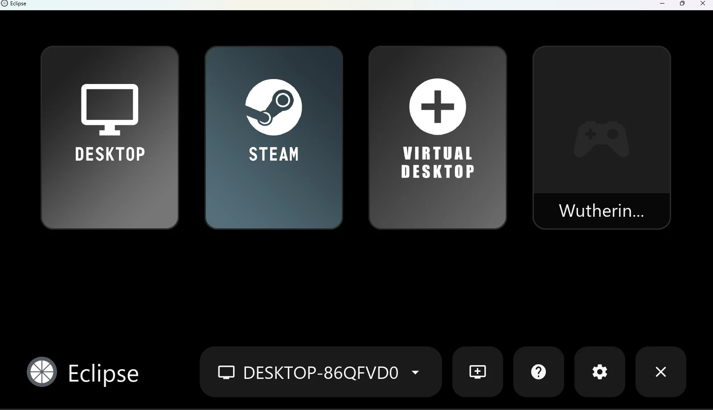
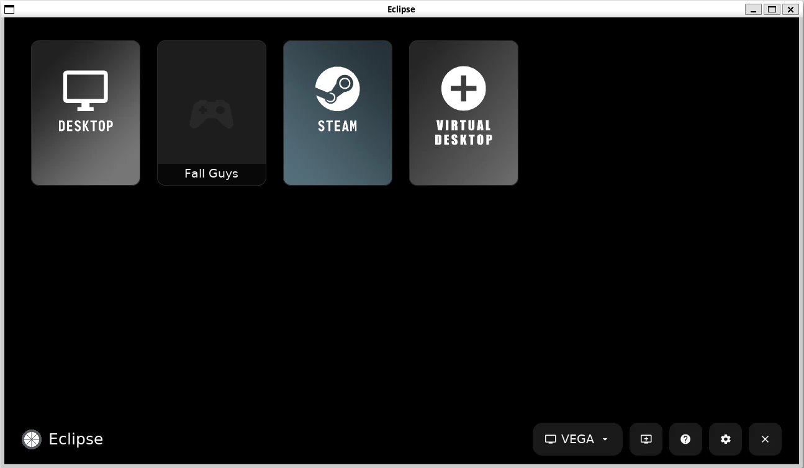
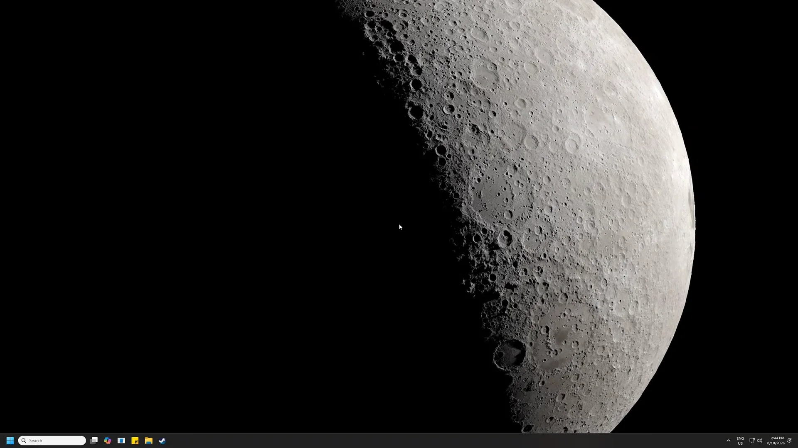
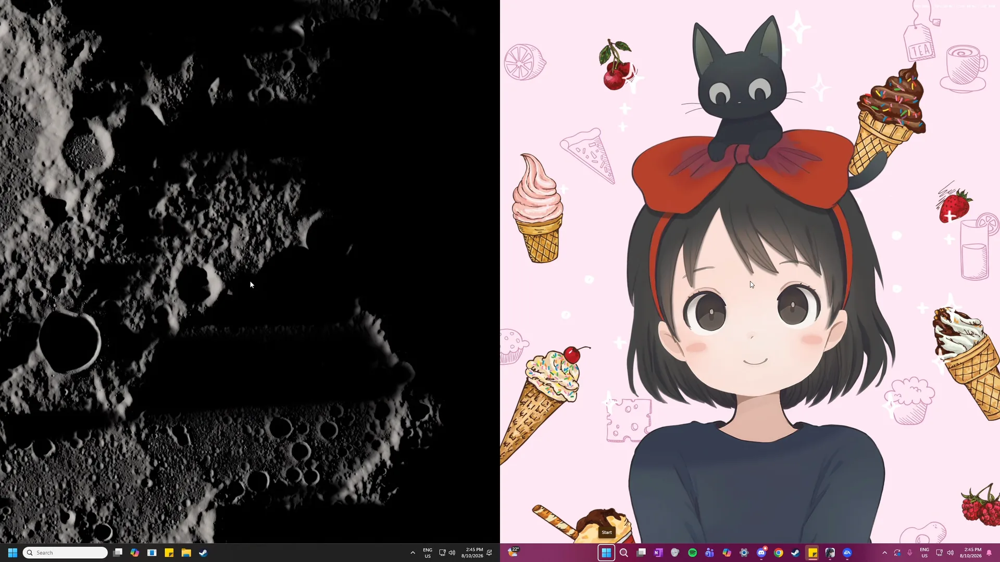

[Project Hub](../README.md) · [Installation Guide](installation.md) · [Eclipse](eclipse.md) · [Umbra](umbra.md) · [Development](development.md) · [Acknowledgements](../ACKNOWLEDGEMENTS.md)

# Eclipse · client

## The screen-side app.

Play a Windows PC’s games on your LG webOS TV, Windows PC or Linux desktop. Pair one host for ordinary streaming, or two Umbra hosts for couch co-op.

Eclipse’s additions use AI-assisted coding. [About the development process.](development.md#development-process)

[Choose your download](#downloads) · [Explore the Project Hub](../README.md) · [Eclipse repository](https://github.com/PreceptorOfMagic/Eclipse)

## Eclipse downloads

Download an attached file under **Assets**, not GitHub’s automatically generated **Source code (zip)** or **Source code (tar.gz)**. Those are developer archives, not installable apps. Use the latest compatible stable release. If no package is attached for your platform, that download is not available.

### LG webOS TV

[LG webOS releases](https://github.com/PreceptorOfMagic/Eclipse/releases)

Open the latest release, expand Assets and choose the package described below. If no release is listed, that package has not been published.

Choose `com.aurora.gamestream_<version>_arm.ipk`. Enable LG Developer Mode, connect webOS Dev Manager and install the IPK. Tested on LG G5 / webOS 26. [Full LG TV installation →](installation.md#eclipse-webos)

### Windows x64

[Windows x64 releases](https://github.com/PreceptorOfMagic/Eclipse/releases)

Open the latest release, expand Assets and choose the package described below. If no release is listed, that package has not been published.

Choose `eclipse-windows-x64-unsigned.zip`, verify its checksum, extract everything and launch `moonlight-tv.exe`. Tested on Windows 11; hardware decoding required. [Full Windows installation →](installation.md#eclipse-windows)

### Linux x86_64

[Linux x86_64 releases](https://github.com/PreceptorOfMagic/Eclipse/releases)

Open the latest release, expand Assets and choose the package described below. If no release is listed, that package has not been published.

Choose `eclipse-linux-x86_64.tar.gz`, extract and run `./eclipse`. Requires glibc 2.35+ and GPU drivers. Native-Linux coverage remains limited. [Full Linux installation →](installation.md#eclipse-linux)

## One client. Both modes.

### Everyday streaming

Host discovery, PIN pairing, game/desktop launch, configurable resolution, frame rate and bitrate, gamepad/keyboard/mouse input, audio and performance diagnostics. H.264 and HEVC on desktop; additional AV1 and HDR paths depend on platform capabilities.

### Two-host co-op

Side-by-side or stacked independent game sessions, player/controller assignments, audio mixing or selection and a compatible encoder mode negotiated with Umbra. [What co-op means, requirements and the system map →](../README.md#how-it-works)

## After installation

Pair one Umbra host and launch a game or desktop. For co-op, verify each host alone before choosing two hosts in Eclipse. You do not need to manually create a host application or edit encoder settings.

[Pair your first host](installation.md#pairing) · [Compatibility and known gaps](../README.md#status) · [Report a problem](installation.md#diagnostics)

## At the client.

**One PC, then two.** Eclipse on Windows, recorded full screen: it streams one PC’s desktop, returns to the library, then opens co-op, picks a layout and starts a two-PC session. Eclipse offers to close the app still running on the first PC before co-op begins. Each half of the finished screen is a different PC, showing its own desktop. [Watch the clip on the website](https://preceptorofmagic.github.io/Eclipse-Umbra-Project-Hub/eclipse.html#preview).

[Eclipse/Umbra licence & notices](../LICENSES.md) · [GPL-3.0](../LICENSE.txt)
