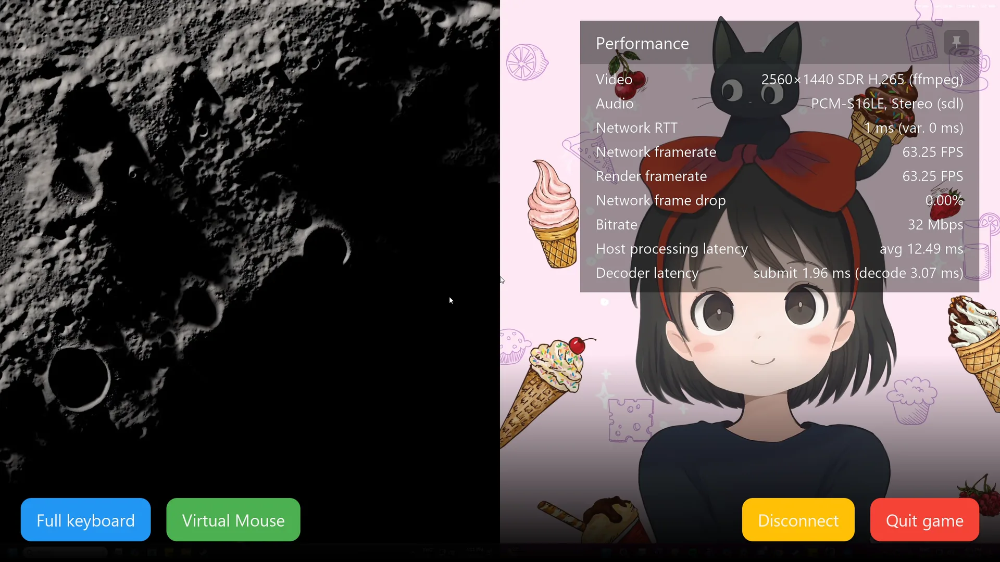
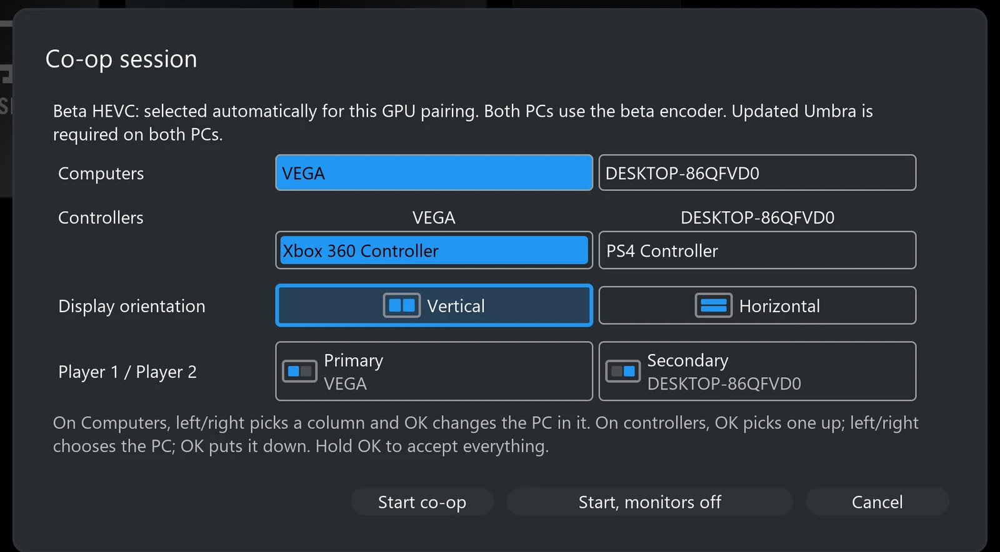
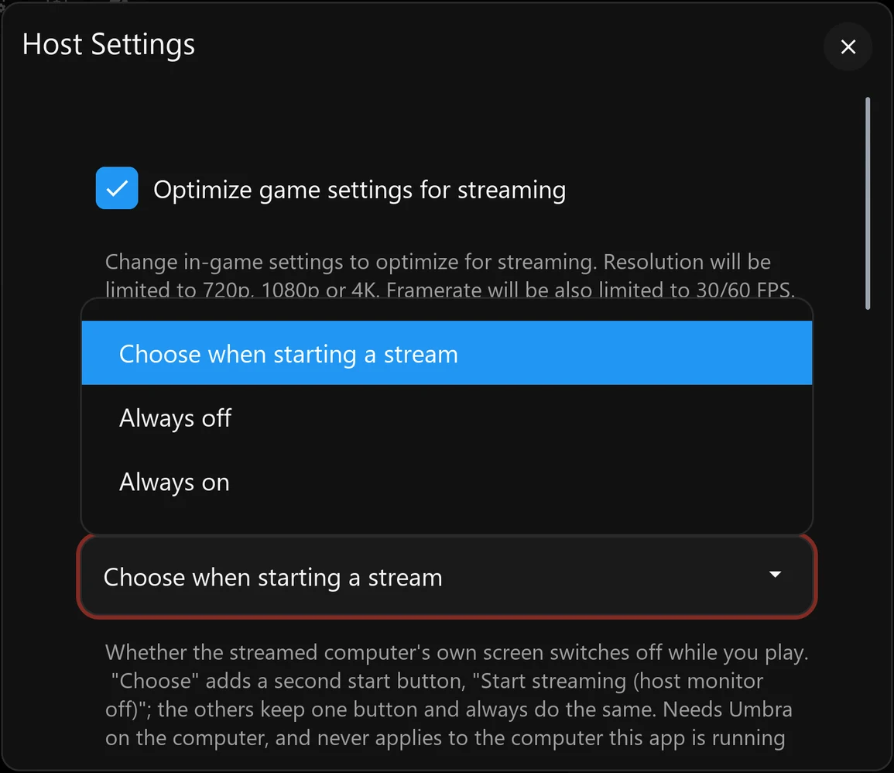
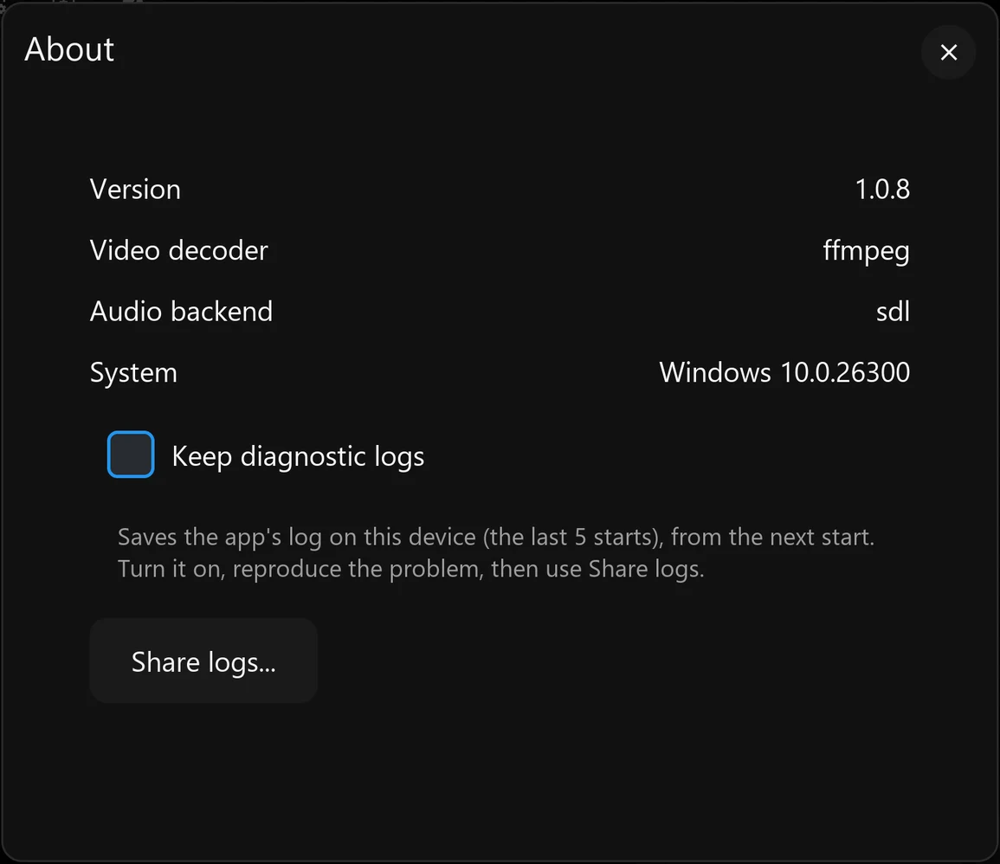

[Project Hub](../README.md) · [Installation Guide](installation.md) · [Eclipse](eclipse.md) · [Umbra](umbra.md) · [Development](development.md) · [Acknowledgements](../ACKNOWLEDGEMENTS.md)

# Streaming features

## Familiar streaming. More ways to play together.

The everyday capabilities come from Moonlight, Sunshine, Moonlight TV, Aurora and Apollo. Eclipse/Umbra builds on that work with coordinated two-host play, device routing and practical improvements. Expand a group for the details.

### The streaming foundation we keep

#### Your PC, remotely

Discover or add a host, pair with a PIN, browse its apps and launch a game or desktop. Video and audio come to Eclipse; your input goes back to the PC. Apollo supplies Umbra’s browser-based host configuration, app management, on-demand virtual displays and per-client permissions.

#### Control picture and sound

Choose resolution, frame rate, bitrate, codec and audio options to suit your connection. H.264 and HEVC are available on current desktop paths; compatible webOS paths can expose AV1 and HDR. Availability is hardware-dependent, not a promise that every combination is tested. Ordinary streaming retains compatible stereo/surround options and stream statistics.

#### Use the controls you have

Gamepads, keyboard, mouse, an on-screen keyboard and a gamepad-controlled virtual mouse remain part of the client experience. Rumble, gyro, touchpad and other controller features depend on the device and platform. Apollo’s host permissions, text-clipboard support and automation hooks are retained; individual client support still matters.

### What Eclipse/Umbra adds and improves

The [hardware matrix](../README.md#status) records the testing limits; the [installation guide](installation.md) covers the packages for each platform.

Two independent PCs, one shared view — Both layouts, automatic desktops and compatible encoding

#### Side-by-side or stacked co-op

Choose two paired Umbra PCs and a layout. Each PC runs its own game and sends its own pane; Eclipse combines the compatible HEVC picture data before decoding the shared view. Neither game needs native split-screen support. This does not add multiplayer to a single-player game: joining the same world still depends on the games and accounts.

#### Desktops that fit their panes

Eclipse requests Umbra’s built-in Co-op Pane at the required size. Windows sees a pane-sized virtual desktop, rather than having half of a full desktop cut off. The pane is managed by the co-op session and normally hidden from ordinary app editing. You should not need to create an application or change hidden host settings.

#### Pair-aware encoder selection

Known NVIDIA pairs use the native HEVC route. For supported mixed NVIDIA/AMD pairings, both hosts use the custom GPU HEVC path so their encoded structures match. The AMD/AMD selection path also exists, but two physical AMD hosts have not been tested on the project rig. Required encoder components must be included on both hosts; Intel co-op remains unverified. The first co-op launch asks once which graphics card make each PC has, because Umbra does not report it yet.

[How compressed-frame composition works](development.md#composition)

One co-op session to manage — A shared bandwidth budget, pause, resume and quit

#### One total video bitrate

By default, Eclipse divides the selected video bitrate between the two hosts instead of requesting the full amount from each. Your normal quality setting therefore describes the combined video budget. Actual network traffic also includes audio, protocol overhead and recovery traffic.

#### Disconnect to pause; Quit to finish

Disconnect preserves a resumable two-host session. Returning to co-op reconnects to those desktops; changing orientation on resume rebuilds the pane displays. Quit game is the separate action that ends both host applications. Resume has been exercised on Windows and Linux; the end-both-hosts check has been recorded on Linux and Windows, with broader packaged-platform checks still needed.

Disconnect from the stream overlay leaves both PCs’ sessions running: the Co-op Pane tile stays live, and choosing Resume streaming on it reconnects both. Quit game then ends both.

*Recorded by an AI assistant (Claude) while the developer was away, as a capability test: every click and key press was planned in advance and played back automatically on live hosts. Wallpapers: [“Moon Light”](https://steamcommunity.com/sharedfiles/filedetails/?id=1539918440) by Sir Crab and [“KIKI&JIJI”](https://steamcommunity.com/sharedfiles/filedetails/?id=2466412743) (art credited to Ayu) by 鬥丨Dou, from the Wallpaper Engine Steam Workshop.*

#### More useful launch failures

A busy host is identified so you can resolve its existing session. If the client lacks launch permission, the message directs you to the host’s Clients settings rather than leaving you with an unexplained permission error.

Controls go to the right PC — Remembered controllers, pane-aware pointing and Nintendo layouts

#### Named, remembered controller assignments

The co-op launch screen and Settings → Co-op let you place controllers under the PC they should control. Assignments are remembered, unclaimed controllers can be distributed, and previously seen disconnected pads remain manageable. Forgetting a controller clears its saved assignments. A controller physically attached to a host is not automatically movable through client forwarding.

Shown with two virtual controllers emulated on the client PC.

#### Mouse and keyboard routing

Pane-aware pointer routing translates coordinates into the target desktop. A drag stays with the PC where the button was pressed, and a key release returns to the PC that received its press. You can instead choose “Assign mouse and keyboard like controllers” to pin devices to a PC for the session. Relative/gamepad virtual-mouse input is a separate path; it should not be assumed to follow hover. Windows routing has recorded tests; TV coverage is less complete.

One mouse, two PCs: crossing the middle line moves input to the other PC. The moving cursor and a right-click menu in each half show which desktop receives input.

*19 seconds · Silent. Recorded by an AI assistant (Codex) as a capability test: every click and key press was planned in advance and played back automatically on live hosts. Real host cursors were enlarged for visibility. Wallpapers: [“Moon Light”](https://steamcommunity.com/sharedfiles/filedetails/?id=1539918440) by Sir Crab and [“KIKI&JIJI”](https://steamcommunity.com/sharedfiles/filedetails/?id=2466412743) (art credited to Ayu) by 鬥丨Dou, from the Wallpaper Engine Steam Workshop.*

#### Nintendo buttons, without remapping every pad

Detected Switch Pro/Joy-Con controllers can follow their printed A/B/X/Y labels or Xbox-style physical positions. Other controllers keep their normal mapping. Recognition is device-dependent, so untested third-party pads may need a report.

#### Remotes do not take the first gamepad slot

Recognised TV/media remotes are excluded from webOS game-controller allocation. On desktop platforms, remote-like devices are placed in higher slots so ordinary gamepads get the low player slots.

[Input ownership and local-host limitations](development.md#input-routing)

Two games, with sound you control — Stereo mixing, speaker restoration and shared sounds played once

#### Mix both PCs or listen to one

Co-op receives stereo audio from each host. Play the shared mix through the client’s output, or select one player’s sound. An advanced buffer setting trades tolerance of uneven arrival for added delay. Co-op’s stereo mixer is separate from the inherited surround options for ordinary streaming.

#### Return the host to its real speakers

Umbra remembers the playback endpoint before switching to streaming audio and restores it after the session. Recovery also handles a display’s audio device returning late or being recreated by Windows under a different identity, reducing the chance of a PC being left on silent virtual speakers.

#### Play shared sounds once

When both games play the same narration, music or effect, Eclipse’s passive gate compares the two PCs’ sound in six frequency bands and mutes the later copy where they match. This reduces matching duplicate sounds; effectiveness varies with the material. **Settings → Co-op → Play shared sounds once** offers Accurate (the default), Fast and Off. Since Eclipse 1.3.4 the gate keeps sounds only one PC played: a band reopens as soon as the later PC plays something the other PC did not, a much quieter copy cannot remove a louder sound, and a sound is no longer removed because of a copy that was itself removed.

**Audio delay.** Accurate holds both streams for its look-ahead plus 5 ms (45 ms by default; a slider sets the look-ahead from 0 to 100 ms), so it can hear each copy start before removing it. Fast holds them for 5 ms (240 samples at 48 kHz) and predicts when a copy is coming. Player 2 already fills a 40 ms buffer to smooth network timing. The gate adds no intentional video buffering. Where Eclipse feeds the speakers itself (Windows, and Linux with PulseAudio), Accurate currently runs as Fast. Off, or listening to one PC, bypasses the gate’s extra delay.

**Tradeoffs.** While a band is closed on a copy, other sound the later PC plays in that band can be muted with it. After enough shared sound, the gate balances the PCs’ volumes by up to 6 dB each. Some games pick their music at random on each PC, so the two PCs play different tracks that cannot be merged; turn the game’s music off on one PC if it sounds doubled. Simulator tests on recorded game audio measured about 23 dB reduction for ordinary speech, 3–7 dB for whispers and breaths, and 1.5–4.7 dB for copies playing 0.5–2% slower. Scored against Halo: Combat Evolved’s own sound files over 76 minutes of recorded co-op, 1.3.4 cut 3% of sounds only one PC played (7% before) and removed one copy of 68% of shared sounds (63% before). These are measurements, not a guarantee of complete duplicate removal.

[How mixing and duplicate detection differ](development.md#audio-routing)

Fit the setup you actually use — Local-host play, monitor control, wired TV networking, desktop usability and clean installs

#### A Windows PC can be a host and the client

Run a game on its own virtual display while Eclipse shows the combined view on a separate display. Cursor and focus hand-off support controlling that local pane without feeding input back into Eclipse. Keep the client off the display being captured. Local controller isolation is not universally solved, especially when other software already holds a controller open.

#### Choose what happens to remote monitors

Settings → Host → Computer’s monitor while streaming offers ask at start, always off or always on. The launch prompt can start co-op with remote monitors off, without switching off the screen of the PC running Eclipse. Requires Umbra support; recorded verification is on Windows, with TV-side coverage still needed.

#### Prefer the TV’s wired adapter

On webOS, the wired-network option identifies the active USB Ethernet adapter and asks a capable Umbra host to direct the session over that connection. Automatic mode uses the extension only when the host advertises it. Wi-Fi need not be disabled; this is not a guarantee for every adapter chipset.

#### A more usable desktop client

Keyboard shortcuts cover fullscreen, capture and stream controls; Windows remembers window position, size and maximisation. Settings can scroll instead of compressing their text into an unreadable panel.

#### Install, update and remove cleanly

Eclipse has a per-user Windows installer that needs no administrator access, with an Apps & features uninstaller that can keep your settings, and per-user install and uninstall scripts on Linux. Umbra has a Windows installer and Ubuntu 22.04/24.04 packages; its uninstaller stops only its own service and processes and lets you keep your settings and shared drivers. Installing a newer version over an older one keeps settings and pairings, and on webOS 26 settings, pairings and co-op keep working after the TV restarts.

Reports that explain what went wrong — Client and host evidence, crash records and shareable bundles

#### Keep diagnostic logs, then Share logs

Enable logging in Settings → About, reproduce the issue and export a report. It includes build identity, platform capabilities, session statistics, settings, second-host information and logs from a capable Umbra host, rather than asking you to find each file separately.

#### Export from the device you are using

Windows saves a local bundle. Linux can also provide a temporary network download page, and webOS lets a phone or PC retrieve the report over the LAN. Crash, frozen-interface and unclean-exit records preserve useful evidence for the next start; they do not automatically repair the fault.

Known secret fields are redacted, but device names and network addresses can remain. Review a bundle before posting it publicly. A TV app that cannot stay open cannot serve its download page.

[Exact logging and export steps](installation.md#diagnostics)

Want the implementation details? The [Development guide](development.md) covers composition, reference-frame holds, buffering, build pipelines and the experiments that shaped them.
