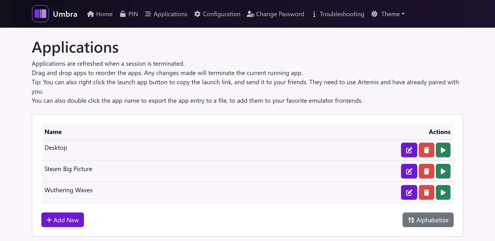
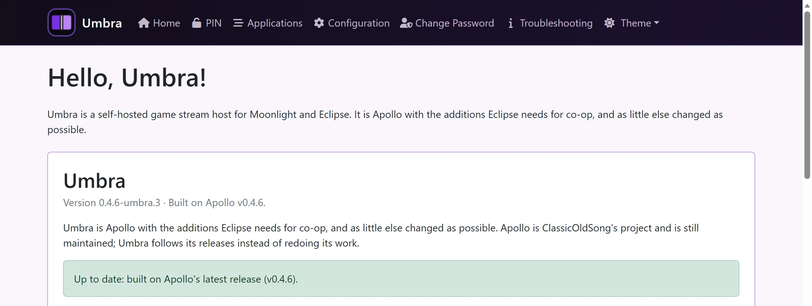

[Project Hub](../README.md) · [Installation Guide](installation.md) · [Eclipse](eclipse.md) · [Umbra](umbra.md) · [Development](development.md) · [Acknowledgements](../ACKNOWLEDGEMENTS.md)

# Umbra · host

## The gaming-PC app.

Stream your games and desktop from a Windows PC. Umbra is Apollo with the additions Eclipse needs for co-op, and as little else changed as possible.

Umbra’s additions use AI-assisted coding. [About the development process.](development.md#development-process)

[Choose your download](#windows) · [Explore the Project Hub](../README.md) · [Umbra repository](https://github.com/PreceptorOfMagic/Umbra)

## Umbra for Windows x64

[Umbra Windows x64 releases](https://github.com/PreceptorOfMagic/Umbra/releases)

Open the latest release, expand Assets and choose the package described below. If no release is listed, that package has not been published.

Choose the Windows x64 installer `.exe` in the latest release’s Assets. Install on each Windows gaming PC, including its bundled virtual-display and device components. Administrator access is needed for installation; no separate device-bridge download is required.

**Already using Apollo?** Umbra and Apollo replace one another; they are not side-by-side installations. Umbra deliberately keeps the Apollo installation folder and registry identity for in-place upgrades. Back up your host configuration and pairings before switching. Installing Apollo again replaces Umbra and removes access to Umbra-specific co-op features.

Windows 11 x64 with NVIDIA RTX 4070 / RTX 3070 and AMD Radeon RX Vega is the current physical test base. Linux/macOS host packages are not an Umbra release target here, even though the upstream Sunshine family supports more platforms.

Download an attached file under **Assets**, not GitHub’s automatically generated **Source code (zip)** or **Source code (tar.gz)**. Those are developer archives, not installable apps. Use the latest compatible stable release. If no package is attached for your platform, that download is not available. [Exact Windows host installation →](installation.md#umbra-windows)

## Apollo first, focused Umbra additions.

[Apollo, by ClassicOldSong and contributors](https://github.com/ClassicOldSong/Apollo), supplies the everyday host experience, built on Sunshine. Umbra keeps that foundation and adds the host-side encoder, session coordination and integration Eclipse needs. It is not a rewrite of Apollo.

Umbra keeps its additions and branding in separate files wherever possible, so Apollo updates can be merged with fewer conflicts. The aim is to follow Apollo’s development, not replace it; an Apollo update still needs to be integrated and tested in Umbra.

### Versions, updates and help

The Umbra panel in the host’s web interface identifies the installed Umbra build and its recorded Apollo release base. Its update notice compares published releases; it does not prove that every newer Apollo commit has been included. Install Umbra releases to retain Eclipse’s co-op additions.

Apollo resource links lead to Apollo’s own pages. For this fork, [report problems to Umbra](https://github.com/PreceptorOfMagic/Umbra/issues/new/choose), not to Apollo’s maintainers.

## The full host, plus co-op.

### Everyday hosting, from Apollo

- PIN pairing, game/desktop entries and a local web interface.
- Per-client permissions and on-demand virtual displays.
- Hardware encoder selection, resolution/refresh negotiation and supported HDR.
- Low-latency audio, gamepad/keyboard/mouse input and session logs.

### Coordinated with Eclipse

Umbra supplies the custom encoder and capability negotiation needed to make compatible co-op streams across different GPU vendors. Eclipse handles joining the streams, presentation and player assignments.

Co-op defaults are separate from regular streaming. The Co-op Pane is built into Umbra and requested automatically by Eclipse; it is not an entry you need to create in the host’s Applications page. [The complete project and system map →](../README.md#how-it-works)

## After installation

Use the installed host shortcut or tray action to open configuration, set up the local login and approve Eclipse’s pairing PIN. Test one ordinary session from each PC before starting co-op.

[Pair an Eclipse client](installation.md#pairing) · [Compatibility and known gaps](../README.md#status) · [Report a problem](installation.md#diagnostics)

## At the host.

**Apollo foundation, Umbra additions.** Umbra’s home page on a host: the Umbra panel gives its version and the Apollo release it is built on, and says whether that is Apollo’s latest release.

[Eclipse/Umbra licence & notices](../LICENSES.md) · [GPL-3.0](../LICENSE.txt)
